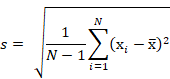
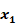
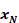

# Generate the Cross Plot Report

To generate the cross plot report

1.  Create a Rollup or Type Well to identify potentially analogous
    wells.
2.  Select the Rollup or Type Well in the entity explorer and go to
    **Cross Plot \| Distribution**.
3.  From the IP (initial production) list, select one of the following
    values:
    | Option | Description |
    |----|----|
    | Peak Calendar Rate | Maximum calendar day rate |
    | Peak Producing Rate | Maximum producing day rate |
    | Initial Calendar Rate | First month’s calendar date rate |
    | Initial Producing Rate | First month’s producing date rate |
    | Average Calendar Rate | Average calendar day rate over a specified number of months (including or excluding the first month). |
    | Average Producing Rate | Average producing day rate over a specified number of months (including or excluding the first month). |
    | A custom user number field | You can [Configure Custom Fields](../../Entity%20Management/View%20and%20Organize%20Entities/Configure%20Custom%20Fields.md) and enter an IP value in each well. Once you create the custom number field, it is displayed in the IP list on the Cross Plot tab. |
4.  Select the **Months** to use (from the start or production) and
    select whether to use the first month of production.
5.  From the View list, select the product you want to view.
6.  On **Cross Plot \| Distribution**, refine the selected wells, if
    required, with one of the following options: 
    | Option | Description |
    |----|----|
    | Double-clicking points on the Probability or Distribution graphs | Double-clicking a selected point deselects it and double-clicking a deselected point reselects it. |
    | Clicking the Use checkbox | Select or deselect wells by clicking the **Use** checkbox in the list of wells. |
7.  Right-click a graph on the Probability or Distribution graphs and
    select one of the following options:
    | Option | Description |
    |----|----|
    | Select/Deselect All | Selects or deselects all wells |
    | Select/Deselect Above/Below Line | After selecting this option, use your mouse to draw a line above or below the wells you want to select or deselect. |
    | Select/Deselect in Rectangle | After selecting this option, use your mouse to draw a rectangle around the wells you want to select or deselect. |

    

    After you select or reselect wells, you need to recalculate the
    values by clicking **Recalculate**.

    
8.  If you have modified the wells used in the Type Well, click **Update
    Type Well**. 
    

    When you update a Type Well on the Cross Plot tab, the deselected
    wells are excluded from the Type Well, but not removed (they are
    displayed as crossed out and their values are not used to calculate
    the Type Well). To remove the wells, go to the Type Well tab and
    click **Remove Excluded**.

    
9.  If required, you can create a new Type Well or Rollup using the
    selected wells by clicking **Create Selected Wells As**.
10. View the Frequency and Probability graphs on the Frequency and
    Probability tabs.

## Standard Deviation Calculation

Value
Navigator uses corrected sample standard deviation (s):

Where:

| N | is the size of the sample |
| --- | --- |
| 

, ..., 

 | are observed values of the sample items |
| 

 | is the mean value of the observations |
