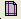

# Batch Manager Report Options

You can select reports in the Batch Manager by clicking
Select/Manage Reports on the Report
Options tab. You can organize the reports in the Report Tree by
Scenario, Batch, Plan, Reserves Category, Entity, and Report.

## Batch Manager Print Preview Functions

| Function | Icon | Description |
|----|----|----|
| Page |   | Reports may have a number of pages. Use the step icons to step through the pages of the report. |
| Zoom |   | The zoom used to display the report can be set. You can also zoom in with a double-left-click, and zoom out with a double-right-click. |
| Pan Mode | 

 | Click and drag the page with the left mouse button |
| Select Mode | 

 | Click and drag to select a subset of the information displayed on the page for pasting into some other product. |
| Print Setup | 

 | Setup the printer by selecting the printer, paper and orientation. This will override the default printer set for the PC. |
| Print | 

 | Open the Print dialog to choose a printer to send the selected report to. The default Windows printer will be selected automatically. |
| Print All | 

 | Open the Print dialog to choose a printer to send all the reports to. The default Windows printer will be selected automatically. |
| Export | 

 | Export the report to a PDF, HTML or CSV file. The CSV file can be opened in Excel. |
| Export All | 

 | Export all reports generated to a set of individual files in a folder using the selected file type, or to a single PDF file. |
| Preview All | 

 | Display all reports in the preview pane as consecutive pages. |
| Open as Spreadsheet | 

 | Open the selected report as a spreadsheet. |
| Unit System | 

 | Toggle between metric and imperial units. |
| Settings | 

0 | Disable the unit scaling. Force all auto-scaled values in reports to use standard units. Example: Gas volumes may be set to Bcf on large volume wells unless this option is disabled to ensure Mcf are displayed. |
