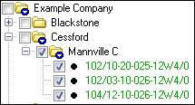
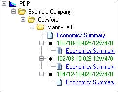

# Create and Run a Batch

You can create report batches that consist of wells, folders, and
reserves categories. This enables you to generate entity-level and
folder-level reports at the same time, in several reserves categories.
If you run several batches simultaneously and select **Consolidate
Results**, the batch results are added together.

Unlike the other reporting methods, the Batch Manager does not report on
entities or folders selected in the Entity Explorer. It has its own
window for selecting entities. However, if you apply a filter to the
project, the filter also applies to the entities visible in the Batch
Manager.

Once you have run a batch, you can select reports or create customized
report lists and use them with your batches. See
[Create a Report List](Create%20a%20Report%20List.md).

## Selecting Folders and Entities

To report on a folder (a summation of all the entities in the folder)
select the folder level in the **Entities to report** window. To report
on an entity, select the entity level. In the example below, the folders
and entities selected in Figure 1 result in the Report List in Figure 2.

| 

 | Â | 

 | Â |
| --- | --- | --- | --- |
| Figure 1: Entities to report. The first and second folder levels and the entity level (one well each) are selected. | Â | Figure 2: Report Tree. The Economic Summary has been selected for the folder level and each entity in the Print Preview. |

You can also select folders and entities by right-clicking in the
Entities to Report window. The table below explains the options in the
context sensitive menu if you have selected a Folder, Ungrouped Entity,
or Grouped Entity.

| Context Menu | Folder | Ungrouped Entity | Grouped Entity |
| --- | --- | --- | --- |
| Select Only folder name | Deselects everything then selects only the folder. | Deselects everything then selects only the entity. | Deselects everything then selects only the entity. |
| Select |
| All Folders And Entities | Selects everything: all folders, ungrouped entities, and grouped entities. |
| All Child Folders and Entities | Selects the folder and all child entities (grouped and ungrouped). | Invalid | Invalid |
| All Child Folders And Top-level Entities | Selects the folder and all ungrouped child entities. Grouped entities are unaffected. | Invalid | Invalid |
| All Child Entities | Selects all child entities (grouped and ungrouped). | Selects the entity and all group children. | Selects the entity and all group children. |
| All Child Top-level Entities | Selects all ungrouped child entities. Grouped entities are unaffected. | Invalid | Invalid |
| All Siblings | Selects all sibling folders and entities. | Selects all sibling folders and entities. | Selects all sibling grouped entities. |
| Deselect |
| All Folders And Entities | Deselects everything: all folders, ungrouped entities, and grouped entities. |
| All Child Folders And Entities | Deselects the folder and all child entities (grouped and ungrouped). | Invalid | Invalid |
| All Child Entities | Deselects all child entities, leaving the folder and any child folders still selected. | Deselects the entity and all group children. | Deselects the entity and all group children. |
| All Siblings | Deselects all sibling folders and entities. | Deselects all sibling folders and entities. | Deselects all sibling grouped entities. |

To create and run a batch using quick selection

1.  On the Standard toolbar, click the **Batch Manager** icon
.
2.  In the **Batch Manager**, click the **Entities** tab.
3.  Under Entity Selection Mode, click Quick
    Selection.
4.  Under **Entities to report**, select the entities and/or folders you
    want to report on. See *Selecting Folders and Entities*, above.
5.  Under **Plans**, select the reserves plan, plan, or calculated plan
    you want to see results for.
6.  Under **Reserves categories**, select the reserves categories you
    want to report on.
7.  On the **Report Options** tab, select the currency you want to use
    for the batch.
8.  Do one of the following:
    | To                            | Do this       |
    |-------------------------------|---------------|
    | Save the batch for future use | Go to step 8. |
    | Run the batch                 | Go to step 9. |
9.  Click **Save as Batch**, enter a name, and click **Save**.\
    The created batch is selected in the batches list.
10. Click **Run.**
11. In the **Print Preview**, click a report to view or click
    **Select/Manage Reports** to create a report list. See
    [Create a Report List](Create%20a%20Report%20List.md).

To run an existing batch or batches

1.  On the Standard toolbar, click the **Batch Manager** icon
.
2.  In the **Batch Manager**, click the **Entities** tab.
3.  Under Entity Selection Mode, click Select
    from Batch list.
4.  In the **Batches** window, select the batch(es) you want to run.
5.  If you are running more than one batch and want to consolidate the
    results, select **Consolidate results**.
6.  On the **Report Options** tab, select the currency you want to use
    for the batch.
7.  At the bottom of the **Batch Manager** dialog box, click **Run**.
8.  In the **Print Preview**, click the reports you want to view or
    click **Select/Manage Reports** to create a report list. See
    [Create a Report List](Create%20a%20Report%20List.md).

To edit a batch

1.  In the **Batch Manager**, click the **Entities** tab.
2.  Under Entity Selection Mode, click Select
    from batch list.
3.  In the **Batches** list, double-click the batch you want to edit.
4.  In the **Batch Editor**, edit your batch and click **OK**.

 
