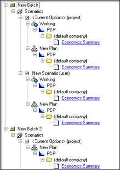
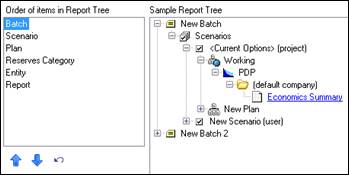

# Organize the Report Tree

The Report Tree displays the reporting levels (Scenario, Batch, Plan,
Reserves Category, and Entity) you are reporting on when you view
reports in the Print Preview (displayed when you select Print from the
File menu or when you run a batch in the Batch Manager).

You can change the order of the levels in the Report Tree by going to
the Organize Report Tree tab of the Select/Manage Reports dialog box.

 

To access the Organize Report Tree tab, do one of the following:

- In the **File** menu, click **Print**. Then click **Select/Manage
  Reports** and click the **Organize Report Tree** Tab.
- On the Standard toolbar, click the **Batch Manager** icon
. Then click the **Report Options** tab and click
  **Select/Manage Reports.** Then click the **Organize Report Tree**
  Tab.

To change the order of levels in the report tree

1.  Under **Order of items** in **Report Tree**, drag the items into the
    order you want or use the **Move Up** and **Move Down** arrows to
    move the items.\
    The change is displayed in the **Sample Report Tree** on the right.
2.  Click **OK** to save your changes.
