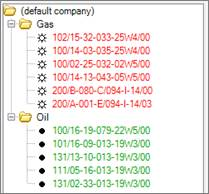
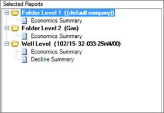
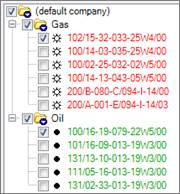
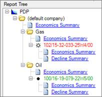

# Report on Folders and Entities

In the Report List, you can generate reports at the folder level or the
entity level or both. To report on any of these levels, you first have
to add folder levels and an entity level to the list. The number of
folder levels in your list should be the same as the number of levels
you want to report on.

Figure 1 shows an Entity Hierarchy and Figure 2 shows a Selected Reports
in the Select/Manage Reports dialog box. In this example, the user wants
to report on the two folder levels and the well level in the Entity
Hierarchy so the Report list has two folder levels and one entity level.
In the Report List, notice that folder name from the Entity Hierarchy is
displayed next to each folder level. For Level 2, only the first folder
name at that level is displayed (Gas). At the Well Level, only the first
UWI is displayed.

While running a batch or scenario, if the user selected the folders and
entities shown in Figure 3 and used the Report List in Figure 2, it
would result in the report tree shown in Figure 4.

|  |  |
|:---|:---|
| 

 | 

 |
| **Figure 1**: Entity Hierarchy with two folder levels. | **Figure 2**: Report List with two folder levels and the corresponding folder names from the Entity Hierarchy. |
| 

 | 

 |
| **Figure 3**: Entities to report. The first and second folder levels and the entity level (one well each) are selected. | **Figure 4**: Report Tree. The Economic Summary has been selected for each folder level and the entity level. The Decline Summary has also been added to the entity level. |
