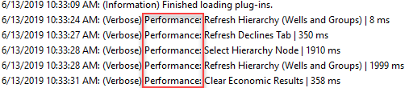
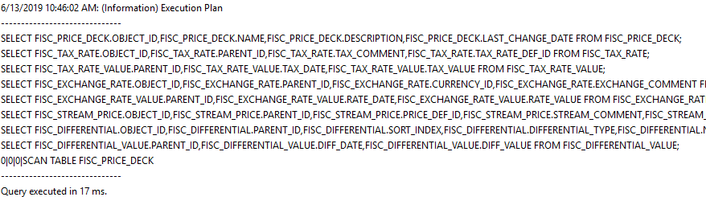
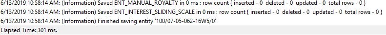
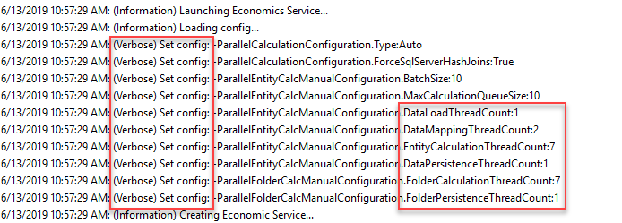
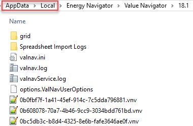

# ENI Value Navigator EXE Config

The Eni.ValueNavigator.exe.config file
contains configuration settings for the main application.

The log file output from these settings is **valnav.log.**

\

This section configures application libraries and should not be edited.

\

This section configures options for how log files are generated. There
are some configurable sub-keys depending on Windows AppData folder
locations and the required level of logging.

\ \

The default setting for the
Value
Navigator application log file is the user’s AppData\Local
folder:

fileName="%LOCALAPPDATA%\Energy Navigator\Value
Navigator\18.1\valnav.log"

This should not be changed, although it may be necessary in some
circumstances, to have the log file written to another location.

Modify the location in “x”.

The **Help menu \&gt; View Log File** link is hard coded to the default
folder location. If this key is modified, users need to browse to their
log file with a network browser.

\ \

This section allows users to control the content of the log file. The
default settings are optimized to balance detail in application events
with logging performance.

For every additional logging category and level added as described
below, there is a performance cost due to the extra processing required
to output log entries. Additional logging will add a significant number
of rows in valnav.log.

The default settings for valnav.log are:

\

&gt; 
&gt;
&gt; \
&gt;
&gt; 
&gt;
&gt; 
&gt;
&gt; \
&gt;
&gt; 

There are three additional event categories that can be added to the log
file and are commented out of the configuration by default.

\

\

\

\

--\&gt;

Performance – adds log entries for every application event, e.g.,
refresh hierarchy selection, refresh declines tab.

SQL Performance – adds a log entry for every SQL call to the project
database.

Persistence Performance – adds log entries for every result row written
to the database.

If any of these options need enabled, uncomment them in the
configuration. E.g.,:

\

&gt; 
&gt;
&gt; \
&gt;
&gt; 
&gt;
&gt; 
&gt;
&gt; \
&gt;
&gt; 
&gt;
&gt; 
&gt;
&gt; \ “Performance”/\&gt;
&gt;
&gt; 

\ \) can be modified for
the level of output. The switch value determines the logging output for
a given category.

Switch values used in the
Value
Navigator configuration are:

- Information – This is the default setting for the “Default” category.
  This logs generally useful events (service start/stop, configuration,
  etc.)
- Verbose – Information that is diagnostically helpful to debug errors
  (IT, sysadmins, etc.).
- All – logs all events

To change the level of logging in any one category edit the text
following \.

For example:

\Information"
name="Default"\&gt;

change to

\Verbose"
name="Default"\&gt;

A category filter must be active for the switchValue to have any effect.

\

Application settings keys configure the behavior of
Value
Navigator on startup and for operations. There are some
configurable elements in this section depending on requirements.

## License Keys

On start-up,
Value
Navigator looks for a license key on the local machine. If this
is not found, such as a user opening
Value
Navigator on a PC for the first time, a pop-up request for a key
is displayed. The user must have a valid key to enter at this point for
the application to launch. When a valid key has been entered once, it is
stored in the system and the application launches normally thereafter.

It may be necessary for administrators to store the license key in the
configuration, where it is entered automatically when required by the
application.

In this case, enter the
Value
Navigator licence key in:

\

Enter the key as “XXX”

## SQL Server Query Performance

In some cases, users may experience a significant time lag at the
beginning of an operation that requires
Value
Navigator to find entities that require calculations (‘delta
checking’). This manifests as a long delay in progress bars that display
the message ‘Determining entities to calculate’.

There is a key in this section that allows administrators to force SQL
Server to force hash joins with a query hint. By default, this option is
commented out of the configuration.

\

\

--\&gt;

Remove the commenting to enable this option. The hash join hint is only
added to the queries associated with delta checking, and may help with
client databases that contain complex fiscal regime results.

## Turn Economics Service On/Off

Economic calculations run in a separate service process by default. This
service takes advantage of workstation processors to thread the
calculation components. The service can be disabled, forcing the
calculations entirely within
Value
Navigator.

This should not be changed, although it may be necessary in some
circumstances to disable the service for debugging.

\true" /\&gt;

Change the key value to
“false”

When the service is disabled, valnav.log will be the only updated log
file.

## Multi-threaded Economic Calculations

By default,
Value
Navigator uses multi-threaded calculations when the environment
permits, i.e. in platform-based database servers (SQL Server, Oracle).
This allows
Value
Navigator to calculate and persist results in separate threads
allowing for faster calculation performance. This is not possible in
file-based databases (.vndb files).

The economic calculation is set to ‘Auto’ by default, allowing
Value
Navigator to determine thread allocations on startup depending on
the number of processors on the host PC.

Normally the ‘Auto’ setting is adequate, however if economic
calculations appear slow, switching the threading to ‘Manual’ may make a
difference.

To enable Manual Economic Calculation Configuration:

1.  Determine what threading configuration is used with ‘Auto’ enabled.

2.  Enable Verbose logging for the Default” category in the economics
    service configuration file. This process is described under the
    Eni.ValueNavigator.Economics.Service.Host.exe.config section.

3.  Launch
    Value
    Navigator. This initiates configurations and writes data to
    the log files.

4.  Close Value
    Navigator. The required information in the log file.

5.  Open the valnavService.log file in the AppData folder with a text
    editor. The thread configuration will be listed after the economic
    service is loaded. The number of available processors is indicated
    in the calculation thread counts, normally 7 in an 8 core PC:
    

6.  Disable verbose logging in the economics service configuration file.
    Set the switchValue back to “Information”.

7.  Modify the economic service type from “Auto’ to ‘Manual’:

    

    \Auto" /\&gt;

    

    Change to

    

    \Manual" /\&gt;

    

8.  Use the information gathered from step 1 to inform decisions for
    thread allocation. Increase the persistence threads to avoid
    bottlenecks in the process such as writing large or complex results
    sets to the database.

The BatchSize and MaxCalculationQueueSize can also be adjusted.

This may be an iterative process to determine what configuration is most
effective in the system being configured.

## Roaming User Profiles

By default,
Value
Navigator uses the Windows "%LOCALAPPDATA%\Energy Navigator\Value
Navigator\18.1\\ folder to store application data files and the
application and economics service log files.

In some cases, it may be preferable to have the application data written
to a Roaming profile instead of Local. This allows users to log in from
different PC’s and retain their application and user settings files, and
their Data View grid templates.

The application configuration file (valnav.ini), stores last used
settings per user in the application such as window location/size,
display units, report lists, etc.

\

Modify this key to ‘true’ from the default of ‘false’ to store
valnav.ini and Data View grid template files in a Roaming profile.

The application user options file (options.ValNavUserOptions), stores
settings per user as specified in **Tools \&gt; Options \&gt; User Options**

\

Modify this key to ‘true’ from the default of ‘false’ to store
options.ValNavUserOptions and Data View grid template files in a Roaming
profile.

Data View grid template files are written to Roaming if either of these
keys are ‘true’.

## Command Timeout

By default, there is a setting to force a command timeout if there is no
response from the system. This can be modified to remove the timeout:

\

Modify this key to “0” to remove the timeout.

## Corporate Options Files

In a large corporate deployment, business rules may be necessary to
point to corporate settings files.

\ Corporate Options
Files

\

\

--\&gt;

Remove the commenting to enable this option. The file path and options
files must exist and be accessible.
