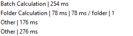
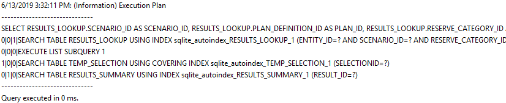

# ENI Value Navigator Economics Service Host Config

Th e
Eni.ValueNavigator.Economics.Service.Host.config
file contains configuration settings for the economics service.

The log file output from these settings is **valnavService.log.**

\

This section configures application libraries and should not be edited.

\

This section configures options for how log files are generated. There
are some configurable sub-keys depending on Windows AppData folder
locations and the required level of logging.

\ \

The default setting for the
Value
Navigator economics service log file is the user’s AppData\Local
folder:

fileName="%LOCALAPPDATA%\Energy Navigator\Value
Navigator\18.1\valnavService.log"

This should not be changed, although it may be necessary in some
circumstances, to have the log file written to another location.

Modify the location in “x”. For example, the log files can be moved to a
Roaming user profile (user’s AppData\Roaming folder) using:

fileName="%APPDATA%\Energy Navigator\Value
Navigator\18.1\valnavService.log"

The **Help menu \&gt; View Economic Log File** link is hard coded to the
default folder location. If this key is modified, users need to browse
to their log file with a network browser.

\ \

This section allows users to control the content of the log file. The
default settings are optimized to balance detail in application events
with logging performance.

For every additional logging category and level added as described
below, there is a performance cost due to the extra processing required
to output log entries. Additional logging may add a significant number
of rows in valnavService.log.

The default settings for valnav.log are:

\

&gt; 
&gt;
&gt; \
&gt;
&gt; 
&gt;
&gt; 
&gt;
&gt; \
&gt;
&gt; 

There are three additional event categories that can be added to the log
file and are commented out of the configuration by default.

\

\

\

\

--\&gt;

If any of these options need enabled, uncomment them in the
configuration. I.e.:

\

&gt; 
&gt;
&gt; \
&gt;
&gt; 
&gt;
&gt; 
&gt;
&gt; \
&gt;
&gt; 
&gt;
&gt; 
&gt;
&gt; \ “Performance”/\&gt;
&gt;
&gt; 

Performance – adds log entries for every application event passed to the
economics service, e.g.

SQL Performance – adds a log entry for every SQL call from the economics
service to the project database.

Persistence Performance – adds log entries for every result row written
to the database.

The impact of this key in the economics service log is minimal as this
option pertains more to saving entity inputs than writing out economic
results rows.

If any of these options need enabled, uncomment them in the
configuration. E.g.:

\

&gt; 
&gt;
&gt; \
&gt;
&gt; 
&gt;
&gt; 
&gt;
&gt; \
&gt;
&gt; 
&gt;
&gt; 
&gt;
&gt; \ “Performance”/\&gt;
&gt;
&gt; 

\ \) can be modified for
output. The switch value determines the logging output for a given
category.

Switch values used in the
Value
Navigator configuration are:

- Information – This is the default setting for the “Default” category.
  This logs generally useful events (service start/stop, configuration,
  etc.)
- Verbose – Information that is diagnostically helpful to debug errors
  (IT, sysadmins, etc.).
- All – logs all events

To change the level of logging in any one category edit the text
following \

\Information"
name="Default"\&gt;

change to

\Verbose"
name="Default"\&gt;

A category filter must be active for the switchValue to have any effect.
