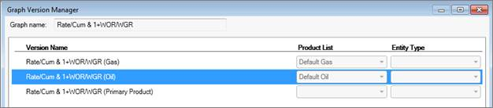

# Create a Graph Version

Graph versions are graphs based on a source graph and related to it.
Graph versions are variations of their source and are automatically
displayed when the selected entity’s Product List or Entity Type matches
the graph’s criteria.

In Value
Navigator, some graphs have versions built in. For example, the
Rate/Cum & 1 + WOR/WGR graph has three versions: Gas, Oil, and Primary
Product. When you view the Rate/Cum & 1 + WOR/WGR graph for various
entities, you do not need to select the Gas version for gas entities or
the Oil version for oil
entities—Value
Navigator automatically detects the entity’s product and displays
the appropriate graph version. The Primary Product version is
automatically displayed for entities with any product other than oil or
gas.

With the Graph Version Manager, you can create custom versions of graphs
based on an entity’s Product List or Entity Type. The appropriate graph
is automatically displayed so you don’t need to select a separate graph
for each entity.

The Rate/Cum & 1 + WOR/WGR graph in the Graph Version Manager. The
Primary Product version is used when the product list is anything but
oil or gas.

## Creating a Graph Version vs. Creating a Copy of a Graph

When you create a graph “version” you are creating a graph that is
related to its original graph. The version is not displayed in the graph
list—only the original graph is in the list. When you want to view a
graph, you select the original graph, but the new version is
automatically displayed for any entity that matches its criteria (such
as Product List or Entity Type).

In addition to creating graph versions, you can also copy a graph and
use it to create a new “standalone” graph. The standalone graph is
displayed in the graph list and is no longer related to the original—you
still need to select it in the graph list when you want to view it.
However, you can also create new versions of the standalone graph. See
[Create and Edit Graphs](Create%20and%20Edit%20Graphs.md).

To create a graph version

1.  On **Predictions \| Declines** or **Predictions \| Volumetrics**,
    right-click any graph and click **Select/Manage Graphs**.
2.  In the **Select/Manage Graphs** dialog box, click the report you
    want to make a new version of and click **Edit.\**
    The **Graph Version Manager** is displayed.
3.  Select the graph version you want to copy and click **Create
    Copy. **
4.  Select **Existing graph** and enter a **Version name**.
5.  Click **Save.**
6.  In the **Graph Version Manager**, click **Close**.
7.  In the **Select/Manage Graphs** dialog box, select the new report
    and click **Edit**.\
    The **Graph Designer** is displayed.

See [Edit Graphs](Edit%20Graphs.md) for
an explanation of how to build the graph.
