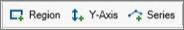
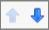
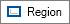
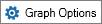
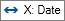
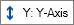
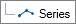

# Edit Graphs

Once you have
[Create a New Graph](Create%20a%20New%20Graph.md),
[Create a Graph Version](Create%20a%20Graph%20Version.md) or
[Create a Graph Copy](Create%20a%20Graph%20Copy.md) , the Graph Designer is displayed. The procedures below
explain how to build and edit a graph.

## Add a Region, Y Axis, or Series

Use the procedures below to add, delete, or move a region.

| To | Do this |
|----|----|
| Add a Region, Y axis, or Series | Click one of these options: . |
| Delete a Region, Y axis, or Series | Click the item in the bottom left of the **Graph Designer** and click  or right-click and click **Delete** |
| Move a Region up or down | In the bottom left of the **Graph Designer**, click the **Region** and then click . |

To edit a **Region**, click  and edit the following
options:

| Option          | Description                                         |
|-----------------|-----------------------------------------------------|
| Name            | Naming a region enables you to assign Y axes to it. |
| Relative height | This is the height relative to the full graph size. |

## Edit Graph Options

To edit the **Graph Options**, click  and edit the
following options:

| Option | Description |
|----|----|
| Description | The description is displayed below the graphs list in the Select/Manage Graphs dialog box. |
| History and forecast start | Displays or hides history and forecast |
| Volumetric recoverable | Displays or hides volumetric recoverable, if available. |
| P/Z recoverable | Displays or hides P/Z recoverable, if available. |
| Background style | Gradient or white. |

## Edit the X Axis

To edit the **X axis**, click  and edit the following
options:

| Option      | Description                                      |
|-------------|--------------------------------------------------|
| Label       | The label is displayed below the X axis.         |
| Major lines | The major X axis lines (vertical) are displayed. |
| Minor lines | The minor X axis lines (vertical) are displayed. |
| Axis type   | The type of data displayed on the X axis.        |

## Edit the Y Axis

To edit the **Y axis**, click  and edit the following
options:

| Option | Description |
|----|----|
| Label | The label is displayed vertically on the Y axis in the Region selected below. |
| Region | Region in which the Y axis is displayed. |
| Location | Specify the left or right side of the graph. |
| Scale | Select Linear or Log. |
| Scaling factor | Select a percentage. |
| Major lines | The major X axis lines (vertical) are displayed. |
| Minor lines | The minor X axis lines (vertical) are displayed. |

## Edit a Series

To edit a **Series**, click  and edit the following
options:

| Option | Description |
|----|----|
| Field type | Select the production, injection, ratio, or other data to be displayed on the series. |
| Data type | The data type depends on the field type selected. |
| Axis | Select the axis on which to display the series. |
| Show labels | Always: Labels are always displayed. With Data: Labels are only displayed when there is data. |
| Legend label | The legend label is displayed at the top of the graph. |
| Axis label | Hides or displays the units for the current axis. |
| History | If selected, displays history in the currently selected colour. |
| Forecast | If selected, displays forecast in the currently selected colour. |
| History and forecast | If selected, displays history and forecast in the currently selected colour. |
| Daily | If selected, displays daily production in the currently selected colour. |
| Backfit | If selected, displays the decline backfit in the currently selected colour. |
| Autofit decline | If selected, displays the autofit decline in the currently selected colour. |
| Autofit points | If selected, displays the points used to create the autofit decline in the currently selected colour. |
| Autofit source points | If selected, displays the points used to create the autofit decline in the currently selected colour, on the source data. |
