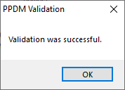
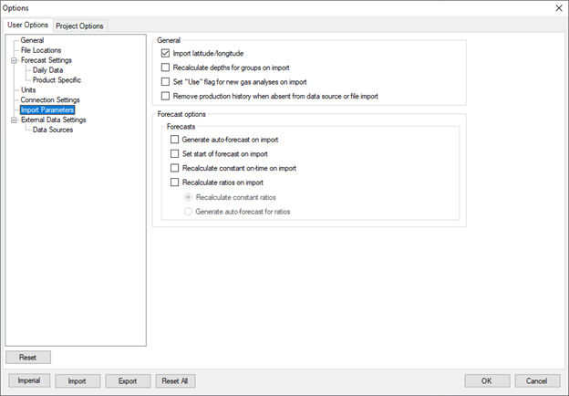

# Configure an ODP DataHub Connection

This topic describes how to configure a Val Nav connection to the Quorum
On Demand DataHub. This connection is required to load data from On
Demand Production Operations (Field Insights) into Val Nav.

## Establishing a Connection from Val Nav to DataHub

### Configure Product Fields

Common products such as condensate, oil, and gas are assigned import
codes in Value Navigator by default. However, if you have added a custom
product and you are able to import production or injection data from a
data hub, you need to assign it an import code.

You must change the product units from metric to imperial as described
below or the import numbers will be incorrect.

To configure products

1.  From **Tools \&gt; Global Project Data \&gt; Products**, navigate to the
    **Import Codes** tab and select **Internal Production System**.

2.  Set the units to **bbl** and **Mcf**.

    

     

### Configure Daily Fields

Daily Pressure fields are custom number fields used to record daily
production data. You can change a field’s name, the type of data it
contains, and other attributes.

To configure pressure fields

1.  From the Tools menu, point to
    Global Project Data and select
    **Daily Pressure Fields**.
2.  In the **Daily Pressure Fields** dialog box, select a pressure field
    for use by clicking the Use checkbox
    on the left.
3.  Under **Field Properties**, type a name for the field and specify
    other attributes, such as Decimal Places, Unit Type, Imperial Units,
    and Metric Units.
4.  Click **OK**.

Daily Pressure Fields that you have selected for use are displayed on
**Predictions \| Data \| Daily**.

### Create a Connection File

The data load uses a Universal Data Link file (.udl) to connect to
DataHub. See [Create a .udl file to connect to a SQL database](Create%20a%20udl%20file%20to%20connect%20to%20a%20SQL%20database.md).

### Turn off Auto-Forecasting

Our recommendation is to turn off auto-forecasting during the import, as
it will eventually be a regular scheduled process where most users will
not want their existing forecasts impacted.

To turn off auto forecasting

1.  Go to Tools \&gt; Options and select the
    User Options tab.

2.  Select Import Parameters and deselect
    everything except Import
    latitude/longitude.

    

     

### Configure Data to Import

Next we’ll configure what data to import. Today, DataHub contains both
monthly and daily production data, so we’ll turn those both on.

To configure the data to import

1.  Go to Tools \&gt; Options and select the
    User Options tab.

2.  Select External Data Settings and
    select the appropriate options under Monthly
    Import Options and Daily Import
    Options.

    

    In the example below, all monthly and daily production history has
    been selected, which we recommend for the initial import. For
    subsequent imports, you may wish to shorten the import range (e.g.,
    6 months of monthlies or 90 days of recent dailies) to reduce the
    amount of data transferred.

    

    

     

### Configure the Connection

To configure the connection

1.  Go to Tools \&gt; Options and select the
    User Options tab and select
    Data Sources.

2.  From the Data source list, select
    Internal Production System, and
    browse to the .udl file you created earlier.

    

     

3.  Click the Advanced button. This is
    where we configure Val Nav to look for specific data in the data
    source. We will configure four tables: WELL_HEADER, WELL_DESC,
    WELL_PROD_HIST, and DAILY_DATA.

4.  For WELL_HEADER, replace the Alias with the view name:
    rpt.view_Val_Nav_Well_Header. 

     

5.  Deselect all columns except those shown in the screenshot above.
    (Your Quorum contact may advise to you to eventually include
    additional columns as the DataHub data set expands).

6.  For WELL_DESC, use this alias:
    rpt.view_val_nav_well_desc and
    include the columns shown below. 

     

7.  For monthly data, decide which of the following four views you’d
    like to use and replace the alias for the WELL_PROD_HIST table.
    Leave all columns selected.

    1.  rpt. view_Val_Nav_Well_Prod_Hist_Allocated_Monthly
    2.  rpt.view_Val_Nav_Well_Prod_Hist_Sum_Of_Daily
    3.  rpt.view_Val_Nav_Well_Prod_Hist_Wellhead_Monthly
    4.  rpt.view_Val_Nav_Well_Prod_Hist_Wellhead_Sum_Of_Daily

    

     

8.  For daily data, decide which of the following two views you’d like
    to use and replace the alias for DAILY_DATA:

    1.  rpt. view_Val_Nav_Daily_Data_Allocated_Daily
    2.  rpt. view_Val_Nav_Daily_Data_Gross_Wellhead

    

     

9.  Click Validate to ensure everything
    is set up correctly. You should see this message:
    

10. Click OK on each of the validation
    message boxes, the PPDM Profile
    Configuration screen, and the Options
    dialog to save all the changes.

## Loading Data

Once the connection is configured, we can trigger loads from within Val
Nav.

### First-time Loads, No Existing Wells

If loading data for the first time (e.g., to kickstart a new DB), we can
use a well list with wildcard matching to load all wells found in
DataHub.

To load wells with a well list

1.  Using Notepad or another text editor, create a new .txt file. The
    contents of the file should be a single percent sign (%) which is
    the ‘match anything’ wildcard. This will match all wells in DataHub.

2.  In your ValNav DB, navigate to File \&gt;
    Import \&gt; From Data Source.

3.  Select Import from data source(s) and
    ensure only Internal Production
    System is selected.

4.  Under Wells to Update, select
    Well List and browse to your wildcard
    text file from step 1. 

     

5.  Click Next and proceed through the
    wizard. (You might experience some slowness the first time Next is
    clicked as it will re-connect to the data source and re-validate).
    You should be able to leave the subsequent wizard pages untouched,
    but feel free to make adjustments to the options if necessary.

6.  Click Finish and wait for the load to
    complete.

Upon completion you may see a warning dialog. For instance, if any of
the wells have negative dailies, you’ll be warned about it, even though
VN supports it (in the dailies only, not the monthlies).

### Rename the Wells

You should now have a set of wells in the DB. They will display with
UWIs being the numeric IDs from DataHub. The well names will have been
loaded, so we can use the Batch Rename tool to clean them up.

To batch rename the wells

1.  In the Val Nav toolbar, switch from Entity
    View to Data View.
    

0
2.  Select the Well Info & General Economics \|
    Well Info and Custom Fields tab.
3.  On the right side, expand the side panel if it is collapsed.
4.  In the Values box, drag
    Well Name to the top of the list.
    This should yield a grid with first column being UWI and second
    being the well names. 

1
5.  Copy the first two columns including the header rows to your
    clipboard.
6.  Open the Batch Rename tool
    (Entity \&gt; Rename Entities).
7.  Paste the copied data and click OK.

The rename process is complete. Once complete you will be presented with
a dialog displaying the rename results.

You may have some wells with unknown or incorrect well types. The well
type in Val Nav has minimal impact but does set the hierarchy icon and
color. Wells with no production are sometimes flagged as ‘Unknown’ well
type, and some wells with injection will come in as ‘Solvent Injection’.
Stay in Data Views and update well types as required by picking new
values in the Well Type column (you can
sort and filter the grid via the column header).

You should now have a start for your Val Nav database, with production
loaded from DataHub!

### Loading Wells to an Existing Val Nav Database

If you already have a Val Nav database, you can connect the wells to
their DataHub data by using Val Nav vendor IDs.

To set up Vendor IDs

1.  Select a well and select Administration \&gt;
    Vendor IDs. 

     

2.  From the Edit menu, select
    Edit \&gt; Show Vendors and ensure that
    Internal Production System is
    selected.

    

     

3.  Click OK. You should now have an
    Internal Production System column in the vendor grid.
    

    To enable loads for this well, the vendor ID must be populated with
    the ID from ODP/DataHub (this is typically a numeric ID). In
    DataHub, the vendor ID is found in the rpt.WellCompletion table, as
    the WellId column. It can also be found in the well header details
    report in the ODP software.

    

4.  Enter the ID for this will and click
    OK.

5.  Complete the vendor ID assignments for the rest of the wells.
    

    Vendor ID edits can be made in bulk by selecting a folder in the VN
    hierarchy. All wells under the folder will be added to the vendor
    grid.

    

Now that the vendor IDs are populated, you can load data through two
different methods:

- File \&gt; Import \&gt; From Data Source
- Entity \&gt; Update From External Source

Both methods will allow you to load all wells, the current filtered set
of wells, or the current hierarchy selection (including folders, where
it will update at descendent wells). These loads will rely on the vendor
IDs to match against the wells in DataHub.

## Scheduling Automated Loads

Once your load is configured and working through the UI, we can schedule
automated loads. This is done using the Val Nav application via the
Windows command-line, and a scheduling tool of your choice.

Please reference the document ‘Val Nav - Automate Production Updates”
which contains the documentation for the command-line parameters. It is
quite straightforward, but you will need to export your user options
(which contain the DataHub connection configuration) to ensure that the
right connection is made. This can be done from the User Options dialog
(Tools \&gt; Options \&gt; User Options) and clicking the Export button in the
bottom left.

Save the file to disk somewhere, and then reference it in the
/useroptions flag in the command.

An example command line is shown below:

"C:\Program Files\Quorum Software\Value Navigator 2023
v2\Eni.ValueNavigator.exe" /import "Internal Production System" /file

"C:\Temp\Example Load from Datahub.vndb" /user example_user /password
example_password /useroptions

"C:\Temp\Example.ValNavUserOptions" /welllist "C:\Temp\wildcard.txt"
/logfile "C:\Temp\Example.log"

In this example, it’s using the/welllist parameter and the wildcard.txt
file from earlier in this documentat to load all wells from DataHub.
This could instead be a list of specific wells (either the VN UWI or the
ODP well ID should be accepted, one line in a .txt file per well), or
omitted entirely to load all wells in the VN DB.

Once you have the command line working (e.g., through the Windows
Command Prompt), use your preferred scheduling/automation tool (e.g.,
Windows Task Scheduler, Informatica, etc.) to do a scheduled load. As we
are loading daily data from ODP, we recommend a nightly load – however,
you could also create two user options files, one for dailies and one
for monthlies, and do a nightly load of daily data and a monthly load of
monthlies.

 
