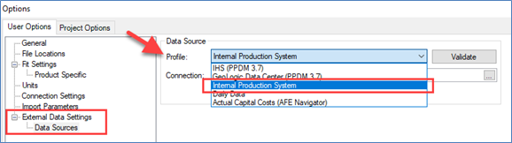
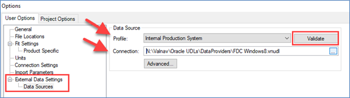
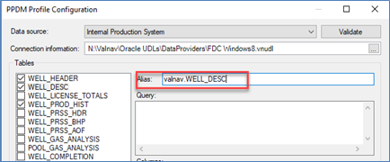
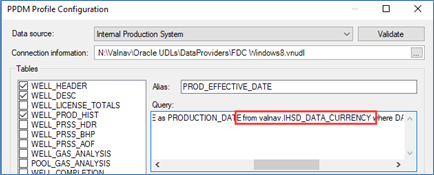
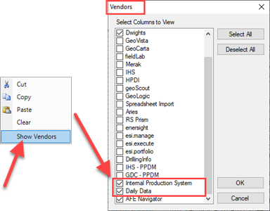
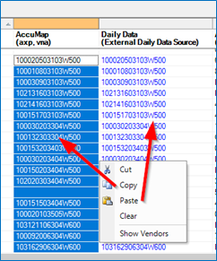
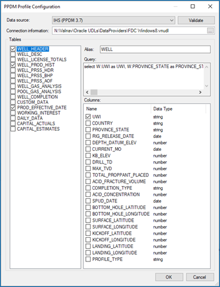
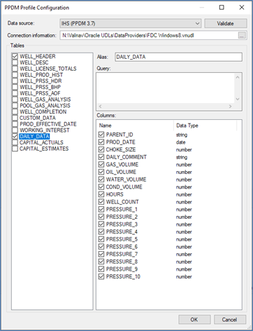
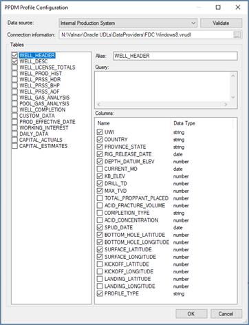
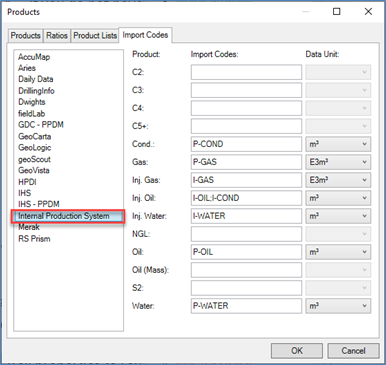

# Create a CDW, FDC, or Internal Production System Link

This topic describes what is required to create a Link to a Corporate
Data Warehouse (CDW), a Field Data Capture (FDC) system or an Internal
Production System using views to allow a direct connection for importing
production data into Val Nav. Materialized views can be used if there
are performance concerns. To access the FDC/CDW data source or Internal
Production System, use the **Internal Production System** Data Source in
**Tools \> Options \> User Options \| Data Sources.**

The views can be created on either SQL Server or Oracle, but Val Nav is
unable to connect to a Microsoft Access database. If you are connecting
to an Oracle server to retrieve the data, use a .vnudl file. If you are
connecting to a SQL server to retrieve the data, use a .udl file.

See [Create a .vnudl file to connect to an Oracle database](Create%20a%20vnudl%20file%20to%20connect%20to%20an%20Oracle%20database.md) or [Create a .udl file to connect to a SQL database](Create%20a%20udl%20file%20to%20connect%20to%20a%20SQL%20database.md).

## Val Nav Data Sources

### Data Source and Connection Information

This is where you select the Internal Production System view and the
.vnudl/.udl file that contains the server connection string to the data
source. The .vnudl file is for Oracle servers and the .udl file is for
SQL Servers. See [Create a .vnudl file to connect to an Oracle database](Create%20a%20vnudl%20file%20to%20connect%20to%20an%20Oracle%20database.md) or [Create a .udl file to connect to a SQL database](Create%20a%20udl%20file%20to%20connect%20to%20a%20SQL%20database.md).

To connect to a .vnudl/.udl file

1.  Open Val Nav.
2.  Select **Tools \> Options \> User Options \> Data Sources**.
3.  Profile = **Internal Production System**.
4.  Connection = Navigate to the .vnudl/.udl file you created.
5.  Click Validate to confirm the
    connection is valid.

## Table Views

The tables that you see selected in **Tools \> Options \> User Options
\> Data Sources** are the basic required tables to import wells, with
monthly or daily production. If daily production is not being imported,
the DAILY_DATA table can be deselected. If monthly production is not
being imported, the WELL_PROD_HIST table can be deselected.

Note: The table **Alias** and **Query** input boxes are important as
they let one insert aliases and queries that will be used instead of the
Val Nav standard table name when Val Nav is querying the database for
data. This also means that the **tables in the database can be named
differently** than you see them in the Internal Production System/CDW
Configuration dialogs in Val Nav.

Best practice is to avoid deviating from the Val Nav default aliases and
queries, and to construct the views even though this will require what
might seem like unnecessary columns.

Dependencies exist in some of the views. For example, DAILY_DATA is used
by some of the other queries. What is important is that the DAILY_DATA
(if you intend to import daily data), WELL, WELL_DESCRIPTION, WELL_NODE,
PDEN_VOL_BY_MONTH, and IHSD_DATA_CURRENCY views exist and have the exact
same columns that are described below.

Not all the columns need to have data populated but they all need to
exist because Val Nav will do a format validation on the tables prior to
loading information.

Note that if the database is in SQL Server and the schema is something
other than dbo then that will need to be defined in the **Alias** and
**Queries**.

For example, if the schema is set to valnav instead of dbo then each
alias that does not have a query associated with it will need to be
changed to reflect this. Each table that uses a query will leave the
alias as is but change the query itself to reflect the schema defined.

**Alias** example WELL_DESCRIPTION

**Query** example PROD_EFFECTIVE_DATE

The alias does not change but the query used does:

*select PROVINCE_STATE as PROVINCE_STATE, COUNTRY as COUNTRY,
DATA_CURRENCY_DATE as PRODUCTION_DATE from **valnav**.IHSD_DATA_CURRENCY
where DATASET_ID = 'IHSD_PROD_DATA' and TABLE_NAME =
'PDEN_VOL_BY_MONTH'*

In many cases it will not make sense to have data in the columns unless
you are using this data to populate information such as well header data
and not just production information.

Application configuration for pulling this data is further described in
the Production Update Process document.

### Vendor IDs

In order to import data, the Vendor IDs in Val Nav must be populated
with the matching unformatted UWI from the data source such as **Daily
Data** or **Internal Production System Profiles**.

To link the Val Nav wells to the source database using the Vendor ID

1.  In Val Nav, select the top company folder to include all the wells,
    then open **Administration \> Vendor IDs**.
2.  Right-click the grid and select **Show Vendors** to add Daily Data
    or Internal Production System, then click OK.
    

3.  If one of your other Vendor records in the Vendor IDs view already
    has an unformatted ID, and it matches the unformatted ID in the data
    source you will be using to import from your data source, you can
    copy and paste that data into the Vendor data source column. Make
    sure these unformatted IDs match what is in your data source tables.
    

4.  If you do not have unformatted IDs already present in your Vendor
    IDs table, or they don’t match the UWIs in your data source tables,
    you have two options for populating the data source Vendor table
    with the unformatted IDs. In both cases, make sure the sort order is
    the same in the source and destination and match the unformatted ID
    from the data source tables to the correct well in Val Nav.
    1.  Copy the UWIs from the data source tables and paste those into
        the respective data source in the Vendor IDs table, making sure
        to match those to the correct UWIs in Val Nav.
    2.  Copy the existing UWIs in Val Nav, paste them into a
        spreadsheet, remove the formatting (there may be a formula in
        Excel that will do this), then paste the unformatted result into
        the respective data source in the Vendor IDs table. Use this
        method only if the unformatted IDs you end up with when you have
        removed the formatting matches the unformatted UWI in your data
        source table.

### Importing Monthly Production History

To Import monthly production history, the WELL_PROD_HIST and
PROD_EFFECTIVE_DATE tables must be selected with all associated columns.
The WELL_HEADER table also needs to be selected, however only the UWI
column is required, the rest of the fields are optional depending on
what information you have and want to import. Selecting only the UWI
column allows only production history to be imported and well properties
to remain unchanged in Val Nav.

Note: If you are importing monthly production history data into
non-Canadian wells, only select **UWI** in the **WELL_HEADER** table to
ensure the country and province/state fields do not change in Val Nav.

### Importing Daily Production History

To Import daily production data, only the DAILY_DATA table needs to be
selected in the **Internal Production System** view with all columns
selected. This will also import production for non-Canadian wells
without changing the country and province/state fields in Val Nav. Daily
Data can be imported with either the **Internal Production System** or
**Daily Data** view.

### Importing Well Properties

Well property data is stored in the WELL_HEADER and WELL_DESC tables. In
the WELL_HEADER table, only the UWI column is required to import the
data, the rest of the columns are optional depending on what information
you have and want to import.

### Common Column Details

Tables that have well data have a unique well identifier. It is called
UWI for all but the PDEN_VOL_BY_MONTH tables where it is called PDEN_ID.
In both cases, this field is a UWI with formatting characters removed.
Note: The UWI will have a two-digit event sequence for DLS well
identifiers.

|                  |                       |
|------------------|-----------------------|
| UWI              | Formatted UWI         |
| 100143608517W600 | 100/14-36-085-17W6/00 |

| Description     |     |     |     | LSD | Section | Township | Range | Meridian | Event |
|-----------------|-----|-----|-----|-----|---------|----------|-------|----------|-------|
| String Position | 1   | 2   | 3   | 4,5 | 6,7     | 8,9,10   | 11,12 | 13,14    | 15,16 |
| Example         | 1   | 0   | 0   | 14  | 36      | 085      | 17    | W6       | 00    |

#### WELL_HEADER

| ValNav Table Name | CDW/FDC Table Name | CDW/FDC Table Columns |
| --- | --- | --- |
| WELL_HEADER | WELL | [UWI] [varchar](40) NOT NULL [BOTTOM_HOLE_LATITUDE] [numeric](12, 7) NULL [BOTTOM_HOLE_LONGITUDE] [numeric](12, 7) NULL [COUNTRY] [varchar](20) NULL [CURRENT_MONTH] [date] NULL [DEPTH_DATUM_ELEV] [numeric](10, 5) NULL [DRILL_TD] [numeric](10, 5) NULL [KB_ELEV] [numeric](10, 5) NULL [MAX_TVD] [numeric](10, 5) NULL [PROFILE_TYPE] [varchar](20) NULL [PROVINCE_STATE] [varchar](20) NULL [RIG_RELEASE_DATE] [date] NULL [SPUD_DATE] [date] NULL [SURFACE_LATITUDE] [numeric](12, 7) NULL [SURFACE_LONGITUDE] [numeric](12, 7) NULL |
| WELL_NODE (subquery) | [UWI] [varchar](40) NOT NULL (subquery) [COORD_SYSTEM_ID] [varchar](20) NOT NULL [LATITUDE] [numeric](12, 7) NULL [LONGITUDE] [numeric](12, 7) NULL [NODE_POSITION] [varchar](20) NOT NULL, |

Always include the WELL and WELL_NODE tables in the views, although some
values can be null.

WELL Column Details

1.  UWI is the common ID as described above (unformatted UWI).
2.  COUNTRY needs to be the literal ‘7CN’
3.  PROVINCE_STATE is the two-digit province code (BC, AB, SK, etc.)
4.  PROFILE_TYPE is a single character
    1.  ‘V’ for Vertical
    2.  ‘D’ for Deviated
    3.  ‘H’ for Horizontal
    4.  ‘S’ for Sidetrack

WELL_NODE Column Details

1.  UWI is the common ID as described above (unformatted UWI).
2.  COORD_SYSTEM_ID is the literal ‘NAD83’
3.  NODE_POSITION is the literal ‘S’ for surface locations and ‘B’ for
    bottom hole locations.

Note: 2 rows must be created for each well. A row for ‘S’ and a row for
‘B’ if you want locations included in the well header information
imported into Val Nav

Example SQL Server Script

/\*\*\*\*\*\* Object: Table
\[dbo\].\[WELL\] Script Date: 2017-01-12 2:48:12 PM \*\*\*\*\*\*/

SET ANSI_NULLS ON

GO

SET QUOTED_IDENTIFIER ON

GO

CREATE TABLE \[dbo\].\[WELL\](

> \[UWI\] \[varchar\](40) NOT NULL,
>
> \[BOTTOM_HOLE_LATITUDE\] \[numeric\](12, 7) NULL,
>
> \[BOTTOM_HOLE_LONGITUDE\] \[numeric\](12, 7) NULL,
>
> \[COUNTRY\] \[varchar\](20) NULL,
>
> \[CURRENT_MONTH\] \[date\] NULL,
>
> \[DEPTH_DATUM_ELEV\] \[numeric\](10, 5) NULL,
>
> \[DRILL_TD\] \[numeric\](10, 5) NULL,
>
> \[KB_ELEV\] \[numeric\](10, 5) NULL,
>
> \[MAX_TVD\] \[numeric\](10, 5) NULL,
>
> \[PROFILE_TYPE\] \[varchar\](20) NULL,
>
> \[PROVINCE_STATE\] \[varchar\](20) NULL,
>
> \[RIG_RELEASE_DATE\] \[date\] NULL,
>
> \[SPUD_DATE\] \[date\] NULL,
>
> \[SURFACE_LATITUDE\] \[numeric\](12, 7) NULL,
>
> \[SURFACE_LONGITUDE\] \[numeric\](12, 7) NULL

) ON \[PRIMARY\]

GO

/\*\*\*\*\*\* Object: Table \[dbo\].\[WELL_NODE\] Script Date:
2017-01-12 2:49:30 PM \*\*\*\*\*\*/

SET ANSI_NULLS ON

GO

SET QUOTED_IDENTIFIER ON

GO

CREATE TABLE \[dbo\].\[WELL_NODE\](

> \[COORD_SYSTEM_ID\] \[varchar\](20) NOT NULL,
>
> \[LATITUDE\] \[numeric\](12, 7) NULL,
>
> \[LONGITUDE\] \[numeric\](12, 7) NULL,
>
> \[NODE_POSITION\] \[varchar\](20) NOT NULL,
>
> \[UWI\] \[varchar\](40) NOT NULL

) ON \[PRIMARY\]

GO

### WELL_DESC

| ValNav Table Name | CDW/FDC Table Name | CDW/FDC Table Columns |
| --- | --- | --- |
| WELL_DESC | WELL_DESCRIPTION | [UWI] [varchar](40) NOT NULL, [CRSTATUS] [varchar](20) NULL, [CRSTATUS_DESC] [varchar](60) NULL, [OPERATOR_DESC] [varchar](60) NULL, [FIELD] [varchar](20) NULL, [FIELD_DESC] [varchar](60) NULL, [POOL] [varchar](20) NULL, [POOL_DESC] [varchar](60) NULL, [UNIT_DESC] [varchar](60) NULL, [WELL_NAME] [varchar](50) NULL, [LICENSEE_DESC] [varchar](60) NULL |

Always include the WELL_DESCRIPTION table, although some values can be
null.

Column Details

UWI is the common ID as described above (unformatted UWI).

Example SQL Server Script

/\*\*\*\*\*\* Object: Table \[dbo\].\[WELL_DESCRIPTION\] Script Date:
2017-01-12 2:50:51 PM \*\*\*\*\*\*/

SET ANSI_NULLS ON

GO

SET QUOTED_IDENTIFIER ON

GO

CREATE TABLE
\[dbo\].\[WELL_DESCRIPTION\](

> \[UWI\] \[varchar\](40) NOT NULL,
>
> \[CRSTATUS\] \[varchar\](20) NULL,
>
> \[CRSTATUS_DESC\] \[varchar\](60) NULL,
>
> \[OPERATOR_DESC\] \[varchar\](60) NULL,
>
> \[FIELD\] \[varchar\](20) NULL,
>
> \[FIELD_DESC\] \[varchar\](60) NULL,
>
> \[POOL\] \[varchar\](20) NULL,
>
> \[POOL_DESC\] \[varchar\](60) NULL,
>
> \[UNIT_DESC\] \[varchar\](60) NULL,
>
> \[WELL_NAME\] \[varchar\](50) NULL,
>
> \[LICENSEE_DESC\] \[varchar\](60) NULL

) ON \[PRIMARY\]

GO

### WELL_PROD_HIST

| ValNav Table Name | CDW/FDC Table Name | CDW/FDC Table Columns |
| --- | --- | --- |
| WELL_PROD_HIST | PDEN_VOL_BY_MONTH | [PDEN_ID] [varchar](40) NOT NULL [ACTIVITY_TYPE] [varchar](20) NOT NULL [PRODUCT_TYPE] [varchar](20) NOT NULL [YEAR] [numeric](4, 0) NOT NULL [APR_VOLUME] [numeric](14, 4) NULL [AUG_VOLUME] [numeric](14, 4) NULL [CUM_VOLUME] [numeric](16, 4) NULL [DEC_VOLUME] [numeric](14, 4) NULL [FEB_VOLUME] [numeric](14, 4) NULL [JAN_VOLUME] [numeric](14, 4) NULL [JUL_VOLUME] [numeric](14, 4) NULL [JUN_VOLUME] [numeric](14, 4) NULL [MAR_VOLUME] [numeric](14, 4) NULL [MAY_VOLUME] [numeric](14, 4) NULL [NOV_VOLUME] [numeric](14, 4) NULL [OCT_VOLUME] [numeric](14, 4) NULL [SEP_VOLUME] [numeric](14, 4) NULL |

Include the PDEN_VOL_BY_MONTH table when importing Monthly Data.

Column Details

1.  PDEN_ID is the common ID as described above (unformatted UWI).
2.  ACTIVITY_TYPE is either the literal ‘PRODUCTION’ or ‘INJECTION’
3.  PRODUCT_TYPE can be any of:

| P-BRKWATER | I-ACIDGAS | I-ETHANE | I-SAND |
| --- | --- | --- | --- |
| P-CO2 | I-AIR | I-GAS | I-SEPPRESS |
| P-CO2MX | I-ALKWATER | I-HOUR | I-SOLV |
| P-CO2SP | I-AMMNITR | I-MICLAR | I-SRCWATER |
| P-COND | I-ANHYAMM | I-NAPTHA | I-STEAM |
| P-GAS | I-BRINE | I-NGL | I-UNDEF |
| P-HOUR | I-BRKWATER | I-NITROGEN | I-WASTE |
| P-NITROGEN | I-BUTANE | I-OIL | I-WATER |
| P-OIL | I-CO2 | I-ONINJ | Â |
| P-ONPROD | I-CO2MX | I-OXYGEN |
| P-PROPANE | I-CO2SP | I-PENTANE |
| P-SRCWATER | I-COND | I-POLYMER |
| P-WATER | I-ENTGAS | I-PROPANE |

1.  UNITS and destination of ‘PRODUCTION’ or ‘INJECTION’ are controlled
    in Val Nav in **Tools \> Global Project Data \> Products \> Import
    Codes \> Internal Production System**.

Example SQL Server Script

/\*\*\*\*\*\* Object: Table \[dbo\].\[PDEN_VOL_BY_MONTH\] Script Date:
2017-01-12 3:02:05 PM \*\*\*\*\*\*/

SET ANSI_NULLS ON

GO

SET QUOTED_IDENTIFIER ON

GO

CREATE TABLE
\[dbo\].\[PDEN_VOL_BY_MONTH\](

> \[PDEN_ID\] \[varchar\](40) NOT NULL,
>
> \[ACTIVITY_TYPE\] \[varchar\](20) NOT NULL,
>
> \[PRODUCT_TYPE\] \[varchar\](20) NOT NULL,
>
> \[YEAR\] \[numeric\](4, 0) NOT NULL,
>
> \[APR_VOLUME\] \[numeric\](14, 4) NULL,
>
> \[AUG_VOLUME\] \[numeric\](14, 4) NULL,
>
> \[CUM_VOLUME\] \[numeric\](16, 4) NULL,
>
> \[DEC_VOLUME\] \[numeric\](14, 4) NULL,
>
> \[FEB_VOLUME\] \[numeric\](14, 4) NULL,
>
> \[JAN_VOLUME\] \[numeric\](14, 4) NULL,
>
> \[JUL_VOLUME\] \[numeric\](14, 4) NULL,
>
> \[JUN_VOLUME\] \[numeric\](14, 4) NULL,
>
> \[MAR_VOLUME\] \[numeric\](14, 4) NULL,
>
> \[MAY_VOLUME\] \[numeric\](14, 4) NULL,
>
> \[NOV_VOLUME\] \[numeric\](14, 4) NULL,
>
> \[OCT_VOLUME\] \[numeric\](14, 4) NULL,
>
> \[SEP_VOLUME\] \[numeric\](14, 4) NULL

) ON \[PRIMARY\]

GO

### DAILY_DATA

ValNav Table Name CDW/FDC Table Name CDW/FDC Table Columns

DAILY_DATA DAILY_DATA \[PARENT_ID\] \[varchar\](40) NOT NULL,

\[PROD_DATE\] \[date\] NOT NULL

\[CHOKE_SIZE\] \[numeric\](14, 4) NULL

\[DAILY_COMMENT\] \[varchar\](40), NULL

\[GAS_VOLUME\] \[numeric\](14, 4) NULL

\[OIL_VOLUME\] \[numeric\](14, 4) NULL

\[WATER_VOLUME\] \[numeric\](14, 4) NULL

\[COND_VOLUME\] \[numeric\](14, 4) NULL

\[HOURS\] \[numeric\](14, 4) NULL

\[WELL_COUNT\] \[numeric\](14, 4) NULL

\[PRESSURE_1\] \[numeric\](14, 4) NULL

\[PRESSURE_2\] \[numeric\](14, 4) NULL

\[PRESSURE_3\] \[numeric\](14, 4) NULL

\[PRESSURE_4\] \[numeric\](14, 4) NULL

\[PRESSURE_5\] \[numeric\](14, 4) NULL

\[PRESSURE_6\] \[numeric\](14, 4) NULL

\[PRESSURE_7\] \[numeric\](14, 4) NULL

\[PRESSURE_8\] \[numeric\](14, 4) NULL

\[PRESSURE_9\] \[numeric\](14, 4) NULL

\[PRESSURE_10\] \[numeric\](14, 4) NULL

Include the DAILY_DATA table only when importing Daily Data. Daily Data
can be imported with the **Internal Production System** data source or
the **Daily Data** source.

Column Details

1.  PARENT_ID is the common ID as described above (unformatted UWI).
2.  Volumes being pulled may require some logic to manage Min, max, or
    sums depending on your FDC system and how the data is being stored.

Example SQL Server Script

/\*\*\*\*\*\* Object: Table \[dbo\].\[DAILY_DATA\] Script Date:
2017-01-12 3:02:05 PM \*\*\*\*\*\*/

SET ANSI_NULLS ON

GO

SET QUOTED_IDENTIFIER ON

GO

CREATE TABLE
\[dbo\].\[DAILY_DATA\](

> \[PARENT_ID\] \[varchar\](40) NOT NULL,
>
> \[PROD_DATE\] \[date\] NOT NULL,
>
> \[CHOKE_SIZE\] \[numeric\](14, 4) NULL,
>
> \[DAILY_COMMENT\] \[varchar\](40) NULL,
>
> \[GAS_VOLUME\] \[numeric\](14, 4) NULL,
>
> \[OIL_VOLUME\] \[numeric\](14, 4) NULL,
>
> \[WATER_VOLUME\] \[numeric\](14, 4) NULL,
>
> \[COND_VOLUME\] \[numeric\](14, 4) NULL,
>
> \[HOURS\] \[numeric\](14, 4) NULL,
>
> \[WELL_COUNT\] \[numeric\](14, 4) NULL,
>
> \[PRESSURE_1\] \[numeric\](14, 4) NULL,
>
> \[PRESSURE_2\] \[numeric\](14, 4) NULL,
>
> \[PRESSURE_3\] \[numeric\](14, 4) NULL,
>
> \[PRESSURE_4\] \[numeric\](14, 4) NULL,
>
> \[PRESSURE_5\] \[numeric\](14, 4) NULL,
>
> \[PRESSURE_6\] \[numeric\](14, 4) NULL,
>
> \[PRESSURE_7\] \[numeric\](14, 4) NULL,
>
> \[PRESSURE_8\] \[numeric\](14, 4) NULL,
>
> \[PRESSURE_9\] \[numeric\](14, 4) NULL,
>
> \[PRESSURE_10\] \[numeric\](14, 4) NULL,

) ON \[PRIMARY\]

GO

### CUSTOM_DATA

ValNav Table Name CDW/FDC Table Name CDW/FDC Table Columns

CUSTOM_DATA CUSTOM_DATA \[UWI\] \[varchar\](40) NOT NULL

\[CUSTOM_FIELD_NAME\] \[varchar\](255) NOT NULL

\[STRING_VALUE\] \[varchar\](255) NULL

\[DATE_VALUE\] \[date\] NULL

\[NUMERIC_VALUE\] \[numeric\](12, 7) NULL

Include the CUSTOM_DATA table when importing Custom Data.

Column Details

1.  UWI is the common ID as described above (unformatted UWI).
2.  CUSTOM_FIELD_NAME will be the text name of the custom fields in Val
    Nav.
3.  STRING_VALUE will contain the value for this custom field if it is a
    text field.
4.  DATE_VALUE will contain the value for this custom field if it is a
    date field.
5.  NUMERIC_VALUE will contain the value for this custom field if it is
    a date field.

Example SQL Server Script

/\*\*\*\*\*\* Object: Table
\[dbo\].\[CUSTOM_DATA\] Script Date: 2017-01-12 3:05:52 PM
\*\*\*\*\*\*/

SET ANSI_NULLS ON

GO

SET QUOTED_IDENTIFIER ON

GO

CREATE TABLE \[dbo\].\[CUSTOM_DATA\](

> \[UWI\] \[varchar\](40) NOT NULL,
>
> \[CUSTOM_FIELD_NAME\] \[varchar\](255) NOT NULL,
>
> \[STRING_VALUE\] \[varchar\](255) NULL,
>
> \[DATE_VALUE\] \[date\] NULL,
>
> \[NUMERIC_VALUE\] \[numeric\](12, 7) NULL

) ON \[PRIMARY\]

GO

### PROD_EFFECTIVE_DATE

ValNav Table Name CDW/FDC Table Name CDW/FDC Table Columns

PROD_EFFECTIVE_DATE IHSD_DATA_CURRENCY \[COUNTRY\] \[varchar\](20) NOT
NULL,

\[PROVINCE_STATE\] \[varchar\](20) NOT NULL,

\[DATA_CURRENCY_DATE\] \[date\] NOT NULL,

\[DATASET_ID\] \[varchar\](20) NOT NULL,

\[TABLE_NAME\] \[varchar\](20) NOT NULL

Include the IHSD_DATA_CURRENCY table.

Column Details

1.  COUNTRY needs to be the literal ‘7CN’
2.  PROVINCE_STATE is the two-digit province code (BC, AB, SK, etc.)
3.  DATA_CURRENCY_DATE is the date to which a well in a province should
    be considered to have data up until. They may only have data up
    until August in production, but the DATA_CURRENCY_DATE may be
    October for example. In this case the well would have been shut in
    for September.
4.  DATASET_ID is the literal ‘IHSD_PROD_DATA’
5.  TABLE_NAME is the literal ‘PDEN_VOL_BY_MONTH‘

Example SQL Server Script

/\*\*\*\*\*\* Object: Table
\[dbo\].\[IHSD_DATA_CURRENCY\] Script Date: 2017-01-12 3:06:48 PM
\*\*\*\*\*\*/

SET ANSI_NULLS ON

GO

SET QUOTED_IDENTIFIER ON

GO

CREATE TABLE
\[dbo\].\[IHSD_DATA_CURRENCY\](

> \[COUNTRY\] \[varchar\](20) NOT NULL,
>
> \[PROVINCE_STATE\] \[varchar\](20) NOT NULL,
>
> \[DATA_CURRENCY_DATE\] \[date\] NOT NULL,
>
> \[DATASET_ID\] \[varchar\](20) NOT NULL,
>
> \[TABLE_NAME\] \[varchar\](20) NOT NULL

) ON \[PRIMARY\]

GO
