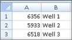

# Import Daily Data

Use the following procedures if you are importing daily production data
for wells that are not already in your project. Once you have completed
the procedures below, you can quickly update your wells using a well
list. See [Update Production Using an External Data Source](../../Update%20Production/Update%20Wells%20Using%20an%20External%20Data%20Source.md).

To configure a daily data connection, see
[Configure an External Data Source](Configure%20an%20External%20Data%20Connection.md).

Because daily data sources identify wells by parent ID, but
Value
Navigator uses UWIs, the two types of IDs must be mapped. The
following procedure explains the easiest way to import wells with daily
data and map the parent IDs to the UWIDs. It involves four basic steps:

1.  Create a well list
2.  Create a mapping file in Excel
3.  Import the wells
4.  Rename the wells (and map the UWIs to the parent IDs).

## Create a Well List

To create a well list

1.  In Excel, paste or type the parent IDs in one column.
2.  Save the file as a .txt file.

You can also use this list for future updates.

## Create a Mapping File in Excel

The mapping file simply lists the parent IDs and the UWIs that
correspond to them.

To create a mapping file

1.  In Excel, type or paste the parent IDs in one column.

2.  In the next column, paste or type the UWIs that correspond to the
    parent IDs. The IDs must be sorted so that each row contains
    matching IDs.

3.  Save the file as a .csv or .txt file.

    

    Column A contains parent IDs. Column B contains UWIs.

## Import the Daily Data

You will import the entities with daily data by their parent IDs first.
Then you will rename the wells with their UWIs.

It is highly recommended that you review and understand the [Fit
Settings](../../Options/User%20Options/User%20Options%20Forecast%20Settings.md)
and [Import
Parameters](../../Options/User%20Options/User%20Options%20Import%20Parameters.md)
in the User Options before importing production data. These settings
affect how data is imported and how forecasts are created in
Value
Navigator.

To import the daily data

1.  From the **File** menu, select **Import**.
2.  In the **Import** dialog box, select **Import from data source(s)**
    and select **Daily Data**.
3.  Under **Wells to Update**, select **Well List**.
4.  Browse to the well list and click **Open**.
5.  Click **Next** and edit the Import Options, if required.
6.  Click **Next** and edit the **Data Source Import Options**, if
    required.
7.  Click **Finish**.
8.  The wells are imported with their parent IDs.

## Rename the Wells (and map the IDs)

To rename the wells

1.  From the **Entity** menu, select **Rename Entities**.
2.  In the **Batch Rename** dialog box, click **Import File**.
3.  Browse to the mapping file you created and click **Open**.\
    The parent IDs and UWIs from your mapping file are inserted into the
    Old UWI and New UWI columns, respectively.
4.  Click **OK**.

The wells are renamed and the parent IDs are automatically mapped to the
UWIs. When you perform future daily data updates, the parent IDs in the
data source will automatically match the UWIs in your project. To
confirm the ID mapping, select **Vendor IDs** from the
**Administration** menu.
