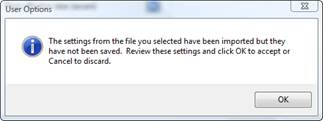

# Import Project and User Options

User Options and Project Options include all items on the User Options
and Project Options tabs of the Options dialog box. 

When you import an .xml file from the User Options tab or Project
options tab, only the User Options or Project Options are imported,
regardless of what other data is in the file. Project and User Options
can also be imported by selecting **Import** from the **File** menu. If
you import from the File menu, all data in the file is imported.

To import User or Project Options from the Options dialog box

1.  On the **Tools** menu, click **Options**.
2.  In the **Options** dialog box, click the **User Options** or
    **Project Options** tab.
3.  Click **Import**.
4.  Browse to the file (.ValNavProjectOptions or .ValNavUserOptions) and
    click **Open**. The following message is displayed:
    

5.  Click **OK** (the settings are not saved yet).
6.  Review the settings in the **Options** dialog box and click **OK**
    to accept the settings or **Cancel** to reject them.
