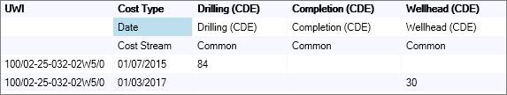
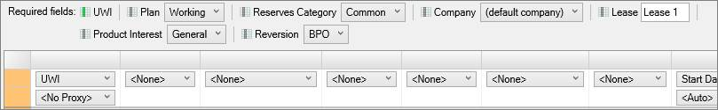

# Import Spreadsheet Data

Before performing this procedure, see the topics below for important
information regarding spreadsheet configuration, import task creation,
and import behavior.

- [Generate a Spreadsheet Import Template](Generate%20a%20Spreadsheet%20Import%20Template.md)
- [Spreadsheet Creation Guidelines](Spreadsheet%20Creation%20Guidelines.md)
- [Create Spreadsheet Import Tasks](Create%20Spreadsheet%20Import%20Tasks.md)
- [Open and Edit Spreadsheet Import Spreadsheets](Open%20and%20Edit%20Spreadsheet%20Import%20Spreadsheets.md)
- [Use Proxy Names for Spreadsheet Import](Use%20Proxy%20Names%20for%20Spreadsheet%20Import.md)
- [Use Vendor IDs in the Spreadsheet Import](Use%20Vendor%20IDs%20in%20the%20Spreadsheet%20Import.md)
- [Validate Spreadsheet Import Data](Validate%20Spreadsheet%20Import%20Data.md)

You can use the Spreadsheet Import tool to import the following:

- Well Information
- Custom Fields
- Production
- General Economics
- Costs
- Prices
- Interests and Royalties
- Plant Gas Properties
- Reserves
- Fiscal Regimes

The tool only displays the spreadsheet content as a preview. You cannot
enter or edit data directly in the Spreadsheet Import tool. You need to
edit information in the spreadsheet. If you need to edit the content of
the spreadsheet while importing, click  (next to
**Sheet)** to open the source file. Then edit the file, save it, and
click the Refresh button in the spreadsheet import tool.

The Spreadsheet Import tool accepts **.xlsx**, **.xlsm** (Microsoft
Excel), or **.csv** files. If you are using Excel, you can enter data in
separate Sheets and then specify these Sheets in the Spreadsheet Import
tool. However, **.csv** files do not support Sheets.

You can use the Spreadsheet Import tool to import data from your
existing spreadsheets without having to copy data into new spreadsheets.
However, you can also
[Generate a Spreadsheet Import Template](Generate%20a%20Spreadsheet%20Import%20Template.md) that
contains all the required headings for whichever data mapping type you
select.

The Preview rows setting determines how
many rows are displayed. It does not affect how many rows are imported
from the spreadsheet.

When importing data into custom user fields, the custom fields must be
created before importing. Wells included in a spreadsheet import that do
not already exist in the project will be created only if the data type
you are using for the import is *Well Info and Custom Fields*. All other
data types will generate an error when imported, stating that the well
does not exist.

To assist with the organization of entities and the estimation of
reserves, you might add:

- User Data for organizing entities
- Reservoir parameters for using volumetric calculations
- Production data from the field that has not yet been added to public
  data hubs

It is highly recommended that you review and understand the [Fit
Settings](../../Options/User%20Options/User%20Options%20Forecast%20Settings.md)
and [Import
Parameters](../../Options/User%20Options/User%20Options%20Import%20Parameters.md)
in the User Options before importing production data. These settings
affect how data is imported and how forecasts are created in
Value
Navigator.

## Import Tasks

When you import data as described below, you are creating an import
task. Each task can only have one type of data, which is called a
*mapping*, such as *Production History-Monthly* or *Well Info and Custom
Fields*. Therefore, if you want to import several types of data
simultaneously, you need to create a task for each. You can create
several tasks in the Spreadsheet Import Tool by clicking
Add Task and then import all of them by
clicking Import All.

The order of the tasks is important because tasks are performed in the
order in which they were created. So, if you want to create new wells
and then import production for them (two tasks), your first task should
have the *Well Info and Custom Fields* mapping (to create the wells) and
the second task should have the *Production History-Monthly* mapping.
When you click Import All, the wells are
created and then the production is assigned to them.

To import a spreadsheet

1.  Select **File** \&gt; **Import** \&gt; **Spreadsheet Import**.

2.  Do one of the following:
    | To | Do this |
| --- | --- |
| Generate a Spreadsheet Import Template | Click  next to Mapping. |
| Use your own spreadsheet, | Next to File, click  to browse to the spreadsheet you want to import, and click Open. The content of the spreadsheet is displayed in the Spreadsheet Import tool. |

3.  If required, select a sheet (.xlsx files only) from the list next to
    the **File** selection field.

4.  From the **Mapping** list, select the data mapping that matches the
    type of data you're importing.

5.  In **Header** rows (below the preview), enter the number of header
    rows to exclude from the import. Header rows are rows that you do
    not want to import.

    

    In this import, the first 3 rows are not part of the import.

6.  Ensure the column headings in the preview match the type of data in
    that column. You can quickly assign a column a single value by
    setting the column heading to **\** and then selecting a
    value in the **Required Fields** area, as shown below.

    

    In this import, the Plan, Reserves Category, Company, Lease, Product
    Interest, and Reversion columns have been set to **None** and
    assigned a single value in the Required Fields area.

7.  Set any empty columns to \ by
    highlighting the column headers and pressing the **Delete** key.
    

    Importing empty columns for fields that already have data in your
    project will overwrite the existing data with a null value.

    

8.  Click  (below the preview) and select one of the
    following Operations: Merge,
    Replace, or
    Replace All.
    

    Before selecting an **Operation**, carefully read the tool tip for
    each operation by placing your mouse pointer over the operation.\
    The operation options control how imported data will affect existing
    data. The operations behavior depends on the data mapping type you
    are working with.

    

9.  Click **Validate** (bottom right). If there are validation errors,
    click **Open log** (next to Validate)
    to view the log file. Correct any errors and continue.

10. If required, click **Add Task** to add another import task and
    repeat the steps above to configure the task.

11. Click **Import** (to import a single task) or **Import All** (to
    import all tasks).
