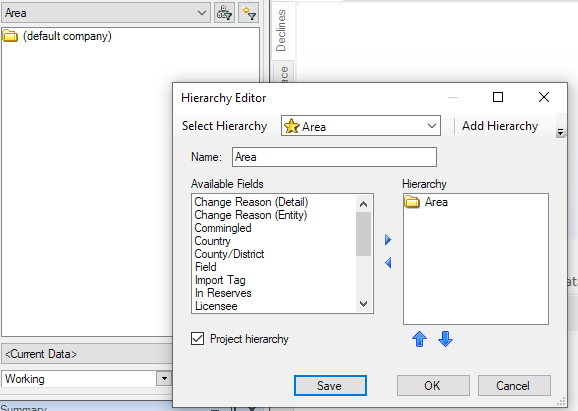
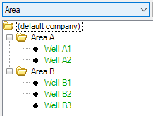
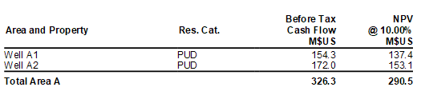

# Val Nav Integration Service Example

This document provides detail on the use of the new import API as well
as using the existing APIs to run economic running a PowerShell script.
Click [here](integration_example_well_results.ps1) to download a
sample PowerShell script.

The high-level steps are:

- Set up the integration service
- Connect to the integration service
- Import data
  - Wells and header data
  - Production forecast arrays
  - Capital costs
  - Operating costs (by proxy)
- Retrieve the DB config for economics
- Run economics
- Retrieve database results (since there is no first-class API for this
  yet)

## Set up the Integration Service

To set up the integration service:

1.  Copy the Val Nav 2022 DB to a local location (e.g. D:\temp\\. Click
    [here](integration_service_2022.vndb) to download.
2.  [Install, configure, and
    verify](Install%20and%20Configure%20the%20Val%20Nav%20Integration%20Service.md)
    the integration service.
3.  Configure the service to point to the .vndb from step 1:
    1.  Open C:\Program Files\Quorum Software\Value Navigator
        Integration Service
        2022\Eni.ValueNavigator.IntegrationService.exe.config
    2.  Use the following sample database to configure it (e.g.,
        \D:\temp\integration_service_2022.vndb\)

## Connect to the Service

To connect to the service:

Run the script: 

\$sysResult =s Invoke-restricted -Uri "http://localhost:8081/api/system"
-UseDefaultCredentials

This issues a GET request to the /api/syhstem endpoint and validates the
result. If successfully connected, the script proceeds.

Note that the entire script takes advantage of the fact that we're using
a *.vndb* file which only has the default *admin* user to avoid Active
Directory and NTML authentication. This will be required in the real
world but this example skips that.

## Import Data

This database is empty of wells to begin with. It has a single custom
field called *Area* and a corresponding *Area* hierarchy defined:

The first step is to bring in wells and headers, including populating
the Area hierarchy with two areas, Area A and Area B:

\$csvBody = @"

UWI,Product List,Well Type,Area,Country,State/Province

Well A1,Oil,Oil,Area A,United States,Texas

Well A2,Oil,Oil,Area A,United States,Texas

Well B1,Oil,Oil,Area B,United States,Texas

Well B2,Oil,Oil,Area B,United States,Texas

Well B3,Oil,Oil,Area B,United States,Texas

"@

\$importParams = @&#123;

Import = \$csvBody

DataArea = "Well Info and Custom Fields"

UpdateMode = "Merge"

Header = "1"

&#125;

\$importResult = Invoke-restmethod -Uri
"http://localhost:8081/api/csvImport" -UseDefaultCredentials -Method
"POST" -Body \$importParams

And the result: wells.

As large imports can take some time to process, the endpoint returns a
job status ID, which you can poll until the import completes. This is
done in the script but it's not shown it here.

The script continues with more imports, one data area at a time. Of note
is the operating costs import, which does the import by proxy – it does
not identify individual wells but just areas. In the CSV payload, see
that the UWI is just *Area A* and *Area B*, and the additional paramater
(Proxy = “Proxy - Area”) in the request body.

\$csvBody = @"

UWI,Plan,Reserves Category,Date,WI Fixed Op Cost,WI Variable Op Cost -
Oil

Area A,Working,PUD,Jan 2023,3000,5

Area B,Working,PUD,Jan 2024,3500,4.5

"@

\$importParams = @&#123;

Import = \$csvBody

DataArea = "Operating Costs"

UpdateMode = "ReplaceAll"

Header = "1"

Proxy = "Proxy - Area"

&#125;

At this point, the imports are complete. This is the point where most
client integration will end – the database has been updated. But for
this example, we’re going to take it further and automate an economic
run for these wells.

## Configure Economics

The next section of the script deals with obtaining the necessary
information to run economics: hierarchy nodes, plans, reserves
categories, and scenarios (or jurisdictions). Each of these has
endpoints to retrieve the current database config. In this case we’re
hard-coding Working - TP for the sole Reserves jurisdiction in the DB.

\$jurisdiction = Invoke-restmethod -Uri
"http://localhost:8081/api/jurisdiction" -UseDefaultCredentials

\$plans = Invoke-restmethod -Uri "http://localhost:8081/api/plans"
-UseDefaultCredentials

\$working = \$plans \| Where-Object &#123; \$\_.DisplayName -EQ 'Working' &#125;

\$rescats = Invoke-restmethod -Uri
"http://localhost:8081/api/reserveCategory" -UseDefaultCredentials

\$tp = \$rescats \| Where-Object &#123; \$\_.Name -EQ 'TP' &#125;

## Run Economics

The script will headlessly trigger an economics run for the *Area A*
folder node.

We first compose the request payload, and then issue the calculate
command to the /api/economic/calculate/hierarchy endpoint:

\$areaAResult = Invoke-restmethod -Uri
"http://localhost:8081/api/economic/calculate/hierarchy"
-UseDefaultCredentials -Method "POST" -Body \$econRunConfigString
-ContentType 'application/json'

Like the imports, economics can be a long-running job, so we receive
back a job ID which we can poll for completion status. When complete,
the full economics run is finished, including well-level results,
folder-level consolidations, and persistence of results into the
database, ready for retrieval.

## Retrieve Database Results

One gap in the integration service is that it doesn’t serve back
economics results. (Well, technically it does, but in a way that only
makes sense if you are Quourm Reserves). Instead, we’re going to reach
into the database directly and retrieve some results.

First the script ensures it has access to SQLite (since our sample
database is a .*vndb* file). If running on a system with Val Nav
installed, the \$runLocal flag tells it to use the installed SQLite DLL.
If not, it can download the assembly direct from the SQLite webpage.

Once SQLite is ready, the script opens a connection to the DB and so on.
Then in loops through the well nodes provided by the hierarchy API
endpoint and retrieves a before-tax cash flow for each (undiscounted and
discounted) by querying BTAX_NET_REVENUE and BTAX_NPV3 from the
RESULTS_SUMMARY table.

The output:

Well A1 BTCF: 154335.506377472

Well A1 NPV @ 10%: 137384.851758335

Well A2 BTCF: 171965.354389965

Well A2 NPV @ 10%: 153097.936602865

We can look in Val Nav at the results in a simple one-liner report.
Because the results were already calculated, Val Nav won’t have any work
to do beyond report rendering. We can see the results are a match for
those retrieved directly via the script:

