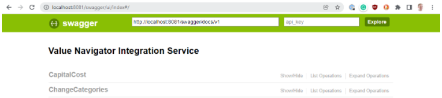
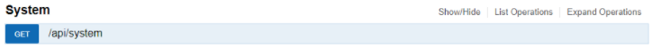
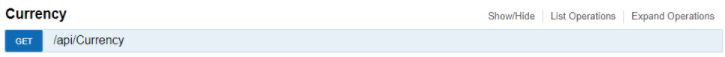

# Verify Installation of the Val Nav Integration Service

Once configured, the Val Nav Integration Service can be tested by
visiting `http://localhost:8081/swagger/ui/index` from a web-browser on
the machine running the Val Nav Integration Service. This will display
the API documentation.





Using the *swagger* interface, run `/api/system` and verify it returns
successfully. The version numbers returned in the Response Body will
help helpful to aid in any future troubleshooting.





The above should return a Response Body like the following. A failure
here would most likely indicate issues connecting to the underlying Val
Nav database, or a mismatch between the Val Nav Integration Service, and
Val Nav.

```

    {
       "DatabaseFilePath": "C:\\files\\vn_execute_integration_sql.vndl",
       "ServiceUserName": "SVC_AFENAV",
       "ValNavVersion": "21.2.0.3",
       "ValNavSchemaVersion": "2021.2.0.2",
       "IntegrationServiceVersion": "21.2.0.34",
       "ConnectionState": "Connected",
       "ServiceLogFilePath": "C:\\...\\Value Navigator Integration Service.log"
```

```
   }
        
```

Next, run `/api/currency` and verify it returns successfully.





It should return a currency like the following:

"\$US"

If the above two tests succeed, the Val Nav Integration Service is
probably configured correctly.
