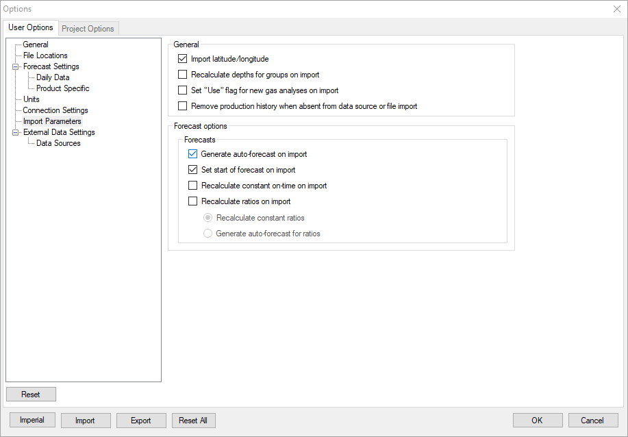

# User Options: Import Parameters

## Import Latitude/Longitude

If enabled, all valid UWIDs will have the existing latitude and
longitude (including zeros) populated with values from the data source.

If disabled, existing values remain as-is. For values of zero,
Value
Navigator calculates the values, based on valid UWIDs.

## Recalculate Depths for Groups on Import

Recalculates GCI, Measured Depth, and True Vertical Depth for all groups
that have children updated on an import.

## Set “Use” Flag for New Gas Analyses on Import

If enabled, imported gas analyses will be marked as **Use** on
**Predictions \| Gas Analysis**.

## Remove Production History when Absent from Data Source or File Import

If enabled, production history is removed from existing wells in your
project if there is no corresponding history in the production import
file or PPDM source.

For example, if you used a spreadsheet to import history for January and
then update the well with a production data file or PPDM source and the
file or PPDM source does not contain history for January, the January
history is deleted.

## Generate Auto-forecast on Import

Creates auto-forecasts for imported wells, when selected.

## Set Start of Forecast on Import

When this option is enabled, the start of all forecasts is moved to the
end of the last production month. When this option is disabled, new
production history is appended to the wells in the project, but the
start of all forecasts is not moved. Therefore, the new production
history and the forecast will overlap.

## Recalculate Constant On-time on Import

When this option is enabled, On-time is recalculated based on the most
recent six months of new production history being appended. Disabling
this option keeps the current On-time of the wells in the project.

## Recalculate Ratios on Import

When this option is enabled, GOR, OGR, and WGR are recalculated based on
the new production history being appended. Disabling this option keeps
the current GOR, OGR, and WGR of the wells in the project.
