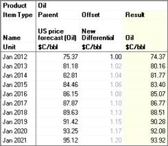
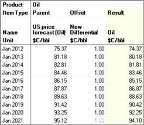

# Add an Entity-level Price Differential

When you add a differential on the Prices
tab, it only applies to the current entity.

To enter a differential for an entity

1.  On **Economics \| Prices & Costs \| Prices**, click in the product
    column you want to add a differential to.
2.  Under **Differentials**, click **Add** or right-click and click
    **Add Differential**.
3.  In the **Add Differential** dialog box, enter a **Name** and
    **Description**.
4.  Select a **Differential Type** and click **OK**.
5.  In the new column, (named **Offset**, **Multiplier** or **(-)
    Factor**) enter the differential on the date you want it to begin.

## Inflation of Price Differentials (Offsets)

General Inflation applies to offsets in price streams in the price deck,
or when applied to an entity on **Economics\| Prices and Costs \|
Prices**. The inflation occurs monthly.

The inflation is only applied to offsets when you use sparse data entry.
For example, if you enter a one dollar offset in 2012, the general
inflation value is applied to all subsequent dates. However, if you
enter a one dollar offset for *each* year from 2012 to 2020, general
inflation is not applied to those numbers, but is applied to 2021 and
onward. See the examples below.

If you do not want the offsets inflated at all, or you want to edit the
inflation rate, see
[Edit Inflation](Edit%20Inflation.md).

### Example 1

In Example 1, a one dollar offset was entered in 2012 only. The one
dollar offset was inflated by 2% annually for all subsequent years.

### Example 2

In Example 2, a one dollar offset was entered for each year from 2012 to
2020. The one dollar offset was then inflated by 2% in 2021.

