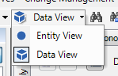
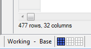
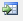
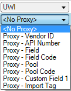
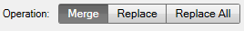
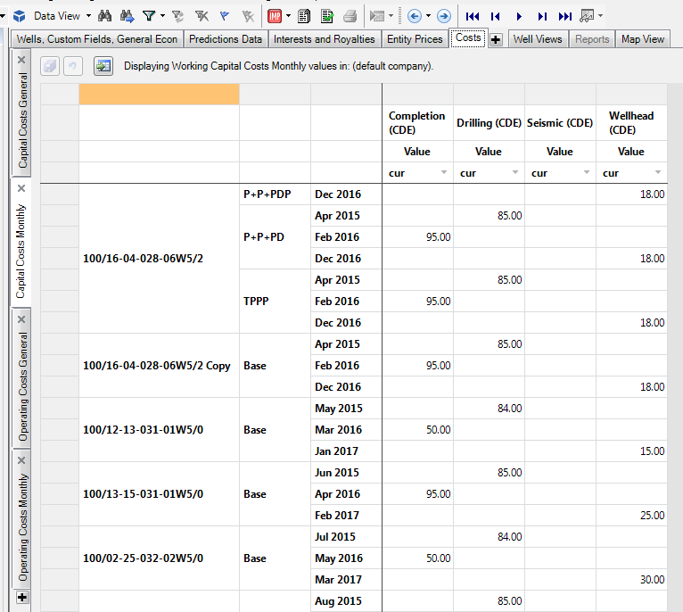

# 2016 v1.0 Release Notes

## Schema Changes

See the Database Administration folder of the release package for more
details of these changes.

## Upgrade Changes

- **If you upgrade to the 64-bit version of
  Value
  Navigator and are using a ..udl or a ..vnudl to connect to a
  data provider (e.g. a PPDM hub, or a database with capital actuals),
  you will need to change the name of the provider from MSDORA.1 to
  Devart.Data.Oracle in the connection string. Open the .udl/.vnudl in a
  text editor such as Notepad, and replace the “Provider” in the file.**
- Previous versions allowed duplicate costs to be created on a well. To
  guarantee accurate reporting, we now force unique names in
  Value
  Navigator 2016. When upgrading from 6.6 to 2016, duplicate
  operating or capital costs will have a number appended to their names
  to make them unique.

## Features

### Data Views (a.k.a. new Well Views)

One of the most powerful features in
Value
Navigator 2016 is the new Data Views. These pivotable,
configurable grids of all your
Value
Navigator input data give you the power and the flexibility to
not only edit your data but to truly understand the data in your
Value
Navigator database.

To start working with the features, switch from Entity View to Data View
in the toolbar:

Users can create their own tab structure in the Data Views, complete
with top-level tabs (Group Tabs) and sub-levels tabs under each Group
Tab. When you first launch
Value
Navigator 2016, you will see a complete set of default tabs with
default templates and data layouts applied to them. These are meant as a
starting point. From here, you can create your own tabs, configure your
own templates and apply them to the tabs. Data View templates are saved
in the same directories as Reports and Graphs. These .vnv files can be
shared between users just as reports and graphs can be.

The Data Layout Panel on the right of each Data View gives users the
power to customize the way the data is displayed in the tab. By moving
data fields between Filters, Rows, Columns, and Values, you can
determine how the data is displayed and pivoted in the grid. The arrow
dropdown beside each field in the Filters, Columns, or Rows allows you
to further configure elements of that specific data field, specifying
whether **All**, **Inputs Only**, or **Show Gaps** is applied, and also
whether data of that field is ordered in **Ascending** or **Descending
Order**.

By default, only Super Users (ie. admins) will be able to edit data in
the Data Views upon upgrade from 2016. We have added a security policy
called “edit inputs in Data Views” and only provided it on upgrade to
users in the Super User role. To allow other users the ability to edit
data in the Data View, you will need to add this policy to their role.
Users with this policy can edit entities in the Data View to which they
would normally have edit rights. All users can view entities in the Data
View without a specific policy.

### Other features of the Data Views

- In the Declines view, you can now view a column called “Segment Error”
  which provides a quick and easy way of seeing which declines segments
  have errors or warnings on them.
- Add date ranges beyond the scope of your current data. By default the
  Data View will show you dates relevant for your data set. However, you
  can add date ranges that do not yet contain data to allow you to
  easily add new information to your database. For example, if you get
  an updated report of monthly operating costs, add the next month, set
  the view to **All** and paste them in.
  
- Use the Row/Column counts at the bottom of each grid to understand the
  size of your data in the current data view
  

- To inspect a well’s inputs that you see on the Data View, right-click
  the entity and choose Go To \ Tab. This will show you the
  input data you are viewing, on the selected entity, in the Entity
  View.
- Export the data in any tab to Excel by clicking at the
  top of the tab.
- You can now edit the Well Type of your entities in Data Views. Edit
  the value in the Well Info and Custom Fields template.
- Select one or more entities in the Data View, right click and choose
  **Select Entities on Entity Explorer** to quickly find those wells in
  the explorer.

### Spreadsheet Import (a.k.a. new Custom Import)

We have re-imagined and re-implemented the Custom Import tool. The new,
ultra-powerful version of this essential data tool is the Spreadsheet
Import. With it, you can now import data into areas you never thought
possible: operating costs, opening balances, decline parameters,
interests, and royalties are just a few of the new data types we have
added to the import.

As its name implies, we now connect directly to an .XLSX spreadsheet
(.CSV files are still ok, but the older .XLS version of a spreadsheet
will not work) to import data into
Value
Navigator. This gives you access to all the great powers that
Excel offers (filtering, formulas, multiple tabs, etc.) and shelters you
from the difficulties previously associated with pasting data into an
import grid (memory limitations, formatting issues, etc.).

Open the Spreadsheet Import tool from File \&gt; Spreadsheet Import (the
Import security policy is required to access it). From here, you can
load as many “import tasks” at once as you like, allowing you to import
data to many different data areas at once. Generally order does not
matter, but if you are creating wells with the import, this task (wells
are created with the **Well Information and Custom Fields** mapping
area) must come first.

To see what kinds of fields can be imported with each data area, leave
the File textbox blank, choose a Mapping, and click the
button to generate an Excel template of all the data fields in that
mapping. You can then paste your import data directly into this
spreadsheet and use it to import.

### Other features of the Spreadsheet Import

Also try out the following features in the Spreadsheet Import tool:

- Well proxy: when importing data into any mapping area, instead of
  importing directly to a UWI, try our proxy alternatives, and import
  data into all entities that match criteria as specified by a proxy
  

- Make sure you review your **Operations** for each data mapping and
  specify whether you want to merge or replace the data you are
  importing with data in the existing database. Depending on the kind of
  data you are importing, these options may have different meanings:
  hover your mouse over the toggle button to get contextual information
  of how the options will affect your selected import.
  

- Click

0 to open a spreadsheet you have linked to make
  changes to the data in your preview. Make the necessary changes, save
  your spreadsheet, and click 

1 to see the updates in the
  preview.
- Use **Required fields** at the top to automatically specify key data
  components for all data in the selected import task. If you want to
  vary the data fields among your data, simply map a column with the
  relevant data.

2

Figure 1 - In the above configuration, all data will be imported into
the Working Plan, but the reserves category will be imported based on
the data in the spreadsheet and may be different for each entity in the
data load.

### Oil + Water (O+W) Forecasting

The new oil + water product provides flexibility in linking oil and
water production forecasts as demanded by two-phase flow. When used in
combination with oil and 1+WOR (or WOR) forecasts, an oil + water
forecast enables modeling fluid handling constraints by acting as a
variable maximum liquid rate. When used with oil or water forecasts, the
program will use the oil + water forecast to define the rate-time
forecast for the complementary product.

If you plan to use the O+W product in your forecasts, you need to select
the appropriate graphs to view the product in the Predictions\| Declines
tab. We have included some default graphs to use to see O+W: “Rate/Time
O+W - Semi-Log. Split” and “Rate/Cum & 1+WOR for O+W Split”.

The O+W forecast can be any type of Arps’s equations. We recommend that
the Arps hyperbolic exponents should be set between 0 and 1 as
recommended by Arps. O+W autofit follows the same standards as auto
fitting oil.

If the O+W rate is less than the Oil rate in any month, the implication
is that water rate is negative. Instead of showing negative water values
the O+W is set equal to Oil.

### New Licensing

Value
Navigator 2016 uses a brand new licensing system. To allow more
flexibility to our users, we built a new license manager and have hosted
it in the cloud. This means your users can have access to their
Value
Navigator licenses from anywhere (though we have many ways to
safe-guard access to your company’s licenses).

Some reasons to get excited about the new licensing:

- Open multiple instances of
  Value
  Navigator on the same machine without using multiple licenses.
- View all current
  Value
  Navigator users with a license in use
- Run Value
  Navigator without being connected to your corporate network
  (you just need access to an internet connection), while also allowing
  your users to check out a license and work without an internet
  connection, as required.
- Administer
  Value
  Navigator licenses in more ways, including:
  - View current active licensing sessions and checked out licenses.
  - Configure how many checked out licenses to allow and the max
    duration of checkout.
  - Control what connections are allowed to a license and revoke access
    to those that aren’t.
  - Report on the history of license requests, and see how many were
    rejected due to reaching max capacity.

#### Information for first-time users of the new licenses

The new system requires an active internet connection to gain access to
the licenses (although we allow a user to “check out” one of their
company’s licenses if they require a license where no internet is
available (this privilege is configurable by administrators). If
Value
Navigator is used where the internet connection is intermittent,
we have contingencies in place (a grace period) to allow the user to
continue working unaffected.

To ensure the licensing system will always be available, we have chosen
to leverage of the reliability of the Microsoft Azure environment.
Although the likelihood of the licensing server becoming inaccessible is
extremely low, we have an Emergency Response Plan at Energy Navigator
should this unlikely situation occur. As a last-case solution, Energy
Navigator also has the ability to issue individual license files for
computers that do not have access to the internet.

Before you can run
Value
Navigator 2016, you will need to call Support to get your new
Product Key. Your production license count has been copied to the 2016
license server so you will have the same number of concurrent licenses
as you do in 6.x. Your 6.x licenses will continue to function until they
expire.

Each user’s instance of
Value
Navigator will need to be activated with the new Product Key. You
must have access to an internet connection for the activation:

To help guarantee security of your company’s Product Key, once it is
entered into the License Manager, it is no longer visible.

If you have additional concerns about the security of your Product Key,
an admin can configure a list of users who cannot gain access to
Value
Navigator with your specific key (or, conversely, configure the
list of users who can gain access to it).

Each company can administer and report on their own licenses to the
extent described above. To do this, you need access to the License
Administration Web Portal. You can get here by browsing to
http://license-admin.energynavigator.com/ or by selecting it from the
Start menu of any computer with
Value
Navigator 2016 installed on it.

5

Contact Value
Navigator Support to get your login name and password to access
your company’s license information in the Web Portal. From here you can:

- Configure the number of concurrent offline users and the offline
  duration
- View the expiry date of your license
- View your Product Key
- Revoke licenses from users
- View active sessions (see which users are currently using licenses)
- View and export a record of instances where max license count was
  reached
- Configure which users cannot use your license (or which can)

## Other Enhancements

Value
Navigator 2016 comes complete with many additional enhancements.

### Removed the hard-coded 250-page limit on PDF (single file) reports

- When exporting to a PDF (single file) report, you will still get a
  warning when you export a large file, but you can now choose to ignore
  the warning and attempt to create the PDF file. In our testing, using
  the 64-bit install and a computer with generous RAM, we were able to
  create very large PDFs (several thousand pages) without running out of
  memory.
- To create large PDFs, it also helps to close all other applications
  before exporting, to free up memory.

### Improved the scroll behavior on the Wellhead \| Data tab

- Now, as much as possible, your date range will be maintained as you
  scroll through wells or move between the History/Forecast/All options.

### Enhancements to Max Life Calculations

- In some cases the 'Maximum economic life' project option caused user
  inputs on a decline to change. This happened when the total volume
  input was used, and the forecast would have naturally extended past
  the Max Life. We forced the forecast to end at Max Life while
  honouring the volume input instead of allowing the forecast to
  continue past this point as per the other forecast inputs.
- Added a project option (Project Options \&gt; General) where
  administrators can set the 'Maximum technical life' for the project.
  On upgrade this value is set the same as the Maximum economic life
  (Project Options \&gt; Economics). The maximum value is 200 years from
  the current year.

### Data Integrity: getting rid of “given key was not present in the dictionary” errors

- We have added some software control to the Plan and Price Deck
  deletion processes:
  - Plans: Now we force the project to be locked in order to delete a
    plan. When you delete a plan in a project, after the cascade/current
    only option is selected, you get a dialog called "Delete Plan
    Definition" that tells you the project must be locked and you must
    be the only user logged in. If you are the only user logged in, but
    have not yet locked the database,
    Value
    Navigator will automatically lock the DB for you while it
    deletes the plan. It will then unlock it after. If anyone else is
    logged in it won't let you. This helps prevent orphaned data.
  - Price Decks: We now ensure a price deck is not being used in a
    Project Scenario before allowing you to delete it. If it is in use,
    you must remove the price deck from the Project Scenario before you
    will be allowed to delete the price deck.

### Improvements to handling of CO2 in Value Navigator

- Previous versions always removed 100% of CO2 when the CO2 composition
  % on the Plant tab was 2% or greater. We removed the arbitrary 2%
  threshold and 100% loss for CO2, and these are now configurable as
  project options.
- New project options:
  - CO2 threshold % - Minimum CO2 threshold allowed in gas streams
    before CO2 is automatically removed.
  - CO2 allowable % - Maximum CO2 value allowed in gas streams after
    processing.
  - On upgrade, the default values for the options are 2% threshold and
    0% allowable to maintain consistent results from previous versions.

### Added the ability to store Value Navigator configuration files in a roaming profile.

- Store Value
  Navigator configuration files (user_config and user_options) in
  a roaming profile or in the local profile, as before. This allows
  users who share computers to maintain a consistent
  Value
  Navigator experience from any computer they log in to.
- The default is %userprofile%\AppData\Local.

Files:

- Valnav.log
- Valnav.ini
- Options.ValNavUserOptions
- \*.vnv – Data Views default files
- Added keys to C:\Program Files\Energy Navigator\Value Navigator 2016
  \&gt; Eni.ValueNavigator.exe.config so that users can switch back to
  roaming profiles if they use them.

Keys:

- \
- \

### Default Scenario/Jurisdiction

- Added a project option where administrators can set a default scenario
  (Project Options \&gt; General \&gt; Default scenario). If the option is
  left blank, reports are always based on the last selected scenario,
  which is the current behaviour. If the option is populated then
  reports are defaulted to the selected scenario every time the
  application is opened. On upgrade the setting is left blank.
  

### Track and report natural gas liquids as totals

- Added an option to the Change Record Summary (Change Management \&gt;
  Change Record Summary) and Reserves Reconciliation (Reserves \&gt; Post
  Reserves) reports to report liquids in detail (current behaviour) or
  as a single ‘Total Liquids’ section.
  

### Show Uneconomic Entities on area property reports

- Added an option in the Report Designer to allow you to “Show
  Uneconomic Entities” in the Hierarchy Table of Area Property Reports.
  This allows you to easily see which entities in a folder are
  uneconomic, as well as those that are economic.

### Blended forecasts on capital costs

- We now allow users the option of generating economic results for
  capital cost forecasts that are a blend of forecast and actual values.
  The original forecast is not lost when the actual values are loaded,
  and results can be generated for the blend or original forecast.
- The checked option to link a well to capital actuals (Link Forecasts
  to Actuals) has been moved to Project Options (Economics \&gt; Run
  economics on blended costs). The option is only active on projects
  that are configured with an AFE link and the default selection is to
  run economics on forecast only. The new project option is available in
  scenarios.
- On upgrade:
  - When a current entity was linked to capital actuals, the capital
    forecast already reflects the actuals and results are the same on
    upgrade. An administrator can set the calculation option to use
    going forward and users can revisit their wells and enter the
    forecast only for reference and/or scenarios.
  - Entities that are not linked will have the original capital forecast
    and the actuals on upgrade. No data is lost and no further work is
    needed. An administrator can set the calculation option to use going
    forward.
  - The 'Has Negative Capital' filter is modified to work with blended
    forecasts. The filter is renamed 'Has Capital Overspend' and works
    against the blended forecast instead of the original forecast.

### Import “well count” via production update

- This data will be imported as long as the WELL_PROD_HIST table and
  PRODUCT_TYPE column are specified in your PPDM Profile Configuration.

### Forecast primary products from ratios

- Added OGR ratio to the default Oil product list and GOR ratio to the
  default Gas product list. This will allow you to select either an Oil
  or Gas phase as required and have all products available to forecast
  as either a product or a ratio. For example on oil wells you can now
  forecast as though you are in a gas phase and just have Oil as a ratio
  without actually changing the phase and affecting royalties.

### Timeout command property is now user-configurable

- The change is made in the config file. The config file is called
  Eni.ValueNavigator.exe.config and is found in the install folder of
  each Value
  Navigator install (e.g. C:\Program Files\Energy Navigator\Value
  Navigator 2016 for the 64-bit version).
  - Open the file in Notepad and find the following line:
  - \
  - \
  - Here you can change the time out, and as the comment indicates,
    setting it to “0” avoids any timeout from occurring.
- To change the timeout, you must make this change on each individual
  computer with
  Value
  Navigator installed, or unpackage the MSI and roll it out that
  way.

### All Users install

- We have changed the Value Navigator installer to now install
  Value
  Navigator for all users on any machine it is installed on
  (previously it only installed for the one who initiated the install).

### Well Creation tool

- For those of you who used the old Custom Import dialog to quickly
  paste a list of wells into the grid and have them created in the
  database, we can now accomplish this with the Well Creation tool
  without having to create a spreadsheet for the Spreadsheet Import. Go
  to Entity \&gt; Create \&gt; Create New Wells to import new UWIs with basic
  entity-level and custom field data.

### Mapping Enhancements

- Added a legend to the Map. When you apply visualizations (bubbles
  and/or color layers), a legend will appear to help you identify the
  colors and scale of the bubbles. The legend is also added to the Print
  Preview of the Map.
- Added a scale bar to the Map.

## Bug Fixes

### Technical

- Fixed an issue where ratio forecasts were being created each time new
  wells were generated via import. Now, we will only recalculate ratios
  if the User Option “Recalculate ratios on import” is checked.
- The default Max Rate for WOR and OGR forecasts will now be 0.
- Previously, gas components on group wells could increment when the
  group was recalculated. This will no longer happen.

### Economic

- We were setting the Termination Date on entity results when a
  currently existing entity was uneconomic before the Reference Date.
  The Termination Date was incorrectly being set to the end of the life
  of the well. It is now not set in that scenario and the Termination
  Date is empty.
- Improved memory management in the Batch Manager so that memory is
  released more promptly each time the Batch Manager is run.
- Fixed an issue where a ring fence or CTE may fail to allocate properly
  on posting. This manifested itself in that the Opening Balance after
  posting could be different than the remaining value which would cause
  an outstanding balance to exist after posting.
- Added alphabetical sorting to the list of product prices in Price Sets
  in the Price Deck Editor.
- Abandonment and salvage costs will now properly be applied when they
  occur after the maximum economic life of a project.
- Fixed an issue in Fiscal Regimes where the chance of success on
  capital resulted in folder level results that did not match expected
  value based on individual entities. We refactored cost details in
  Fiscal Regimes to expose success and failure components, and fixed the
  ring fence equal allocation on risked cases to only allocate to the
  success result. This makes sure the total gets the full allocation
  even if there is no failure step.
- Fixed an error that could occur when calculating an entity with
  delayed abandonment on it that was part of a CTE/ring fence.
- Fixed an issue where remaining incentives balances could be lost after
  an economic limit occurs. This sometimes manifested itself in previous
  versions as wells missing balances on the Remaining Balance—Incentives
  report, or just having the report be entirely blank.

### Reporting and graphs

- Fixed an issue with the Production/Reserves data in the Custom
  Reporter where some wells with underscores in their names would not
  appear in SQL Server.
- Custom Result Fields (CRFs) are now identified by name (not GUID) when
  they are added to report designer reports. Thus, when a report is
  copied or shared, as long as the database contains the same CRFs by
  name, they will appear properly (previously, if the report was shared,
  the CRFs would appear as \#Err because the GUIDs would not match).
- Fixed an issue where the cumulative oil volume on graphs was being
  overstated by historical cumulative volume (Alberta oil prior to
  1962). Data from ent_historical_cumulative was being added to the
  graph series multiple times. This is now resolved.

### Other

- Made improvements to how
  Value
  Navigator protects global data to prevent “Given Key Not
  Present in Dictionary” errors. You can now not delete a plan unless
  the database is locked, and price decks that are referenced in Project
  Scenarios cannot be deleted.
- User hierarchies could be deleted if a user deleted a newly-created
  project before opening another existing project. This will no longer
  happen.
