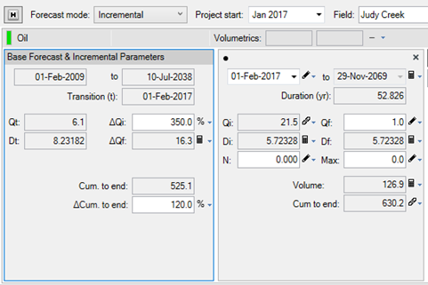
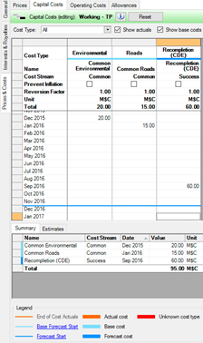
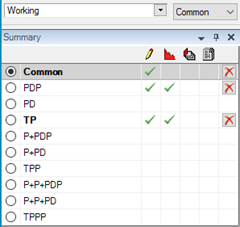
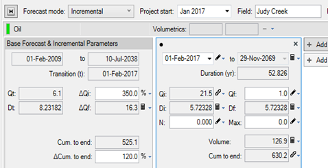
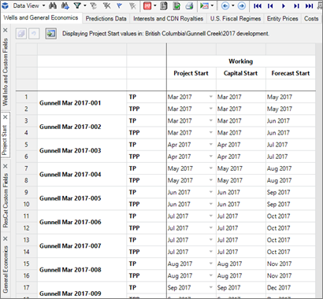
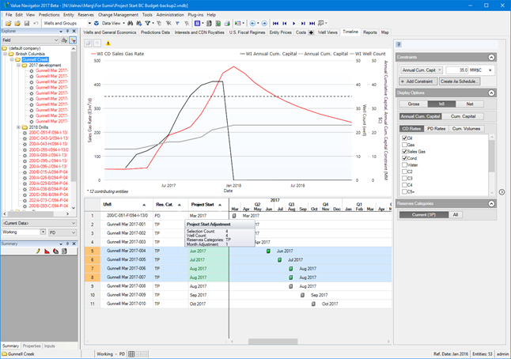
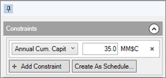
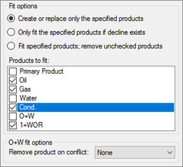
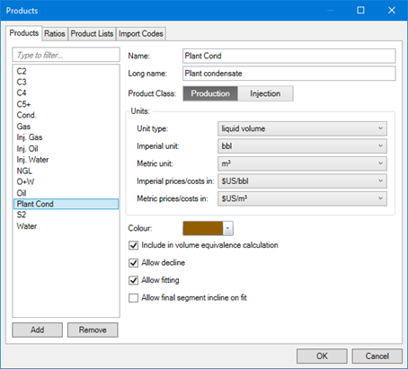
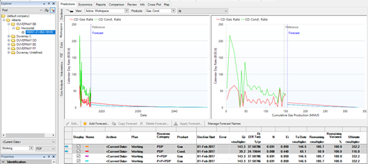

# 2017 v1 Release Notes

## Features

The focus of 2017 is Inventory Scheduling. This includes many new
features that all act together to provide the ability to schedule new
wells. Users can create incremental additions to base forecasts, relate
them to a start date, and visualize additions to existing production and
see constraints. These views can be saved as Schedules, and can easily
be modified, either visually or via Data Views.

For further information on 2017 Features, refer to the Spotlight
documents included for the Release.

### Incremental Forecasts

A major improvement in
Value
Navigator 2017 is the ability to define workover segments for
declines and capital. The workover feature allows you to define a base
forecast and then increment future work without having to re-define the
total forecast. Now you can simply define the work you are about to do.
Use the ‘Forecast mode’ selection on a well to define whether it will be
using a base forecast with incremental segments, or will still use the
classic behaviour we have labeled ‘Total’ mode. All wells in previous
versions of
Value
Navigator will upgrade to Total mode in 2017 with no change in
forecasted volumes. Incremental or Total forecast mode is an entity
level setting, not per reserves category.

Not only can you create incremental segments, you can also decide how
they relate to the base forecast, either by specifying an absolute
change, or by using a relative change that is based on the transition
date of the new segment. For example, a 350% increment will factor the
rate at the transition point (t) by 350% which means that no matter when
your workover starts, the new Qi will always be a relative increment.

Capital works the same way, where capital costs in the base forecast can
be seen in TP, where you can add additional capital that represents new
work only.

Here you can see all the costs that make up the TP case, while only
having to input the capital associated with the workover in TP.

### Common Reserves Category

Users frequently describe their incremental work to us in terms of their
‘base forecast’ plus new additional work. We’ve adopted that terminology
and so we renamed the ‘Base’ reserves category to ‘Common’, which is
still where you enter inputs common to all categories.

### Project Start Date

Now that you can easily create workover forecasts, you can also easily
adjust them in time. Project Start is a method of anchoring all Res Cat
level date inputs to a single anchor so that all inputs can be adjusted
at once. When Project Start is adjusted, all date inputs on the Res Cat
are adjusted by the same amount.

Project Start can be set per Res Cat on the Declines tab (add it from
the hamburger menu ) or, bulk edit these dates in Data Views. A new
default Project Start grid displays Project Start, as well as read-only
Forecast Start date and first capital input date.

### Timeline Tab

The Timeline tab is a new feature designed to visualise and allow drag
and drop editing of Project Start dates.

The top graph displays production and capital data for all entities in
the current hierarchy selection, which allows you to see current
production along with scheduled additions.

The bottom gantt-chart control allows users to drag Project Start dates
for scheduled additions.

The Options panel configures display options and allows users to create
constraints on product and capital values.

- Constraints are displayed along with the product series on the graph.
- Entities in the current hierarchy selection with current production
  are indicated as contributing entities

### New Entity Type: Schedules

Schedules are a way to make projects easy to manage. They will also be
the basis for future scheduling enhancements in
Value
Navigator.

- The existing Bulk Well Schedule tool has been renamed: Bulk Well
  Generator
- All the functionality remains, but will be transitioned to Schedules
  along with new features in future releases.
- Schedules are a new entity type, and can be created from the entity
  menus, or from the Data Views \&gt; Timeline tab (Create as Schedule
  button).

### Support for Multiple Products

Another way of working more effectively is the ability to work with all
products at once. Multi-product support has been added to:

- Best fit forecasting on secondary products
- Best fit forecasting on custom products
- Workspace tab
- Type Wells

### Best Fit Forecasting on Secondary Products

In previous versions of
Value
Navigator, the Best Fit routines were only available for the
primary product on any well. A 1+WOR fit was also available for oil
wells.

In 2017, the fitting routines are available on products regardless of
whether they are primary or secondary. Fitting is not available for
ratios.

Best Fits can be generated for any product selected under ‘Products to
fit:’ in the Best Fit and Refit dialogues.

### Best Fit Forecasting on Custom Products

Best Fit functionality is now available on any product with liquid
volume or gas volume unit types. Best Fits can be generated for any
product selected under ‘Products to fit:’ in the Best Fit and Refit
dialogues.

Custom Products will show up in the Best Fit list if they are flagged as
‘Allow decline’ and ‘Allow fitting’ in the Products dialogue.

The Product option ‘Allow final segment incline on fit’ will stream a
product fit through the 1+WOR routine, so the forecast is not forced to
decline.

Product Specific fit settings can be entered in User Options for all
fit-able products.

### Predictions \| Workspace tab – All products

In conjunction with allowing fits on all products, we have included
these products on the Workspace tab in a multi-product display.

Select the products to view from the Products dropdown in the graph.

The baseline selection highlights all product rows for the selected
forecast key configuration.

### Type Wells – All Products

The functionality of Type Wells has been expanded to support forecasts
on multiple products.

The Type Well - Options dialogue has a new Product selection, which
displays all products associated with the selected Product List.

0

### Multi-ResCat Reports

In previous versions of
Value
Navigator, the Report Designer worked with values returned from a
single economic context at a time. We can now report multiple reserve
category results on the same report, and run them from the Reports tab.
This allows users to show different cashflows for example, or provide
summary info (1P, 2P, 3P, for instance) on one-line summary reports.

A group method has been added to Hierarchy tables in the Report
Designer. The control allows for reserves category selections at the
total (e.g. Probable) major level, or detailed (e.g. Probable Additional
Undeveloped) minor level.

There are new reports added to the built-in report selection:

- Area Property Report - Co. Share, NPV by Res. Cat.
- Area Property Report - Net & NPV by Res. Cat.
- Area Property Report - WI & NPV by Res. Cat.
- Cash Flow Summary by Res. Cat.
- Gross Lease Reserves by Res. Cat.

## Enhancements

### Project option for Negative Revenue

- Previous versions of
  Value
  Navigator reported negative revenue resulting from a net
  negative product price as an operating cost. There is now a project
  option in the Economics section to report this results stream as
  negative sales revenue.
- Project Options \&gt; Economics – 'Report negative product revenue as
  operating costs'

### Gross Overriding Royalties with Deductions

- Added the ability to tag operating costs as GOR Deductible. The costs
  are offset against a gross overriding royalty, optionally up to a
  limit specified on Interest Properties (GOR Deduction Cap %)

1

### Default inputs are now written to the database

Previous versions of
Value
Navigator would create economic results even though users did not
specifically create any inputs other than a forecast. Input tabs
displayed default values even though they were not written to the
database. This caused confusion when validating inputs and results. For
example, a 100% working interest was always used until a user changed
the value.

- Default inputs are now written to the database on entity creation.
  Queries against Interests, Price Sets, Allowances, and General
  Economics options will always return values.
- Because they are now written to the entity, the default values are
  immediately visible on Data Views grids.

### Condensate added to Daily Data

Condensate has been added to products available for Daily Data and
integrated into the following tools:

- Import via a custom Data Source connection
- Import via the Spreadsheet Import tool
- View on the Data \&gt; Daily tab
- Administration \&gt; Data Cleanup \&gt; Convert Oil/Condensate now works for
  Daily Data
- Available as a series on graphs
- Included in reports

### Price Factors in Scenarios

- Added a simple method for scaling entity level prices in Scenarios.
- Use ‘Price Factor %’ in the Sensitivity section to factor entity price
  and royalty prices in a scenario calculation.

### Additions to Accumap (.vna) files

- Added Surface latitude and longitude to the file; both surface and
  bottomhole are now available.
- Added Zone information
- Added License Number
- Additional product data is now supported, and imported for wells with
  those products in their Product List:
- Steam (Accumap Import Code 250,9)
- CO2 (250,10)
- Fluid (250,11)
- Inj. Steam (260,9)
- Inj. Oil (260,10)
- Inj. Polymer (260,11)
- Inj. CO2 (260,12)
- Inj. Air (260,13)

### Net Operating Income by NPV in Report Designer

Added new Cash Flow data fields to the Report Designer:

- Net Operating Income NPV1
- Net Operating Income NPV2
- Net Operating Income NPV3
- Net Operating Income NPV4
- Net Operating Income NPV5
- Net Operating Income NPV Auto

### Price Deck Labels

- Inflation settings have been moved from Tax Rates into a new Inflation
  section
- General Inflation has been renamed ‘Inflation of Price Differentials’

### Delete Capital Actuals

There is a new option under the Administration \&gt; Data Cleanup menu -
Delete Capital Actuals. This was previously supplied as a plug-in to
clients who link to actual capital costs in AFE’s.

## Bug Fixes

### Technical

- Fixed an issue with upgrades from 2016 v2 where a project would fail
  to upgrade. Projects with some unsolvable O+W forecasts were not
  processed correctly.
- Fixed an issue in the Bulk Well Generator (previously Bulk Well
  Schedule) tool did not correctly set start of forecast for all
  products. The start date for the primary product is now set to the
  date generated by the tool, and offsets are honored for other
  products.
- Modified the behavior of the Bulk Well Generator tool so that only
  date values for inputs on forecasted ResCats are adjusted when wells
  are generated. Date values in the Common input category will not be
  adjusted. This includes gas liquids forecasts in the Plant tab.
- Modified the Copy ResCat and Advanced Copy tools to handle incremental
  forecasts.
- If an incremental segment is moved to PDP, then the resolved decline
  is copied. The new forecast in PDP is an exact copy of the source.
- If an incremental segment is copied to another non-PDP ResCat then
  only the ResCat inputs are copied.
- Fixed an issue where Well Type was incorrectly set on a production
  import. Now we honor the type in the data source rather than
  calculating the type based on a ratio of oil and gas volumes.
- Fixed an issue with importing production from .vna files that resulted
  in some wells incorrectly designated as injection. The presence of a
  single row of injection data would re-set Well Type, because the
  production data had already been processed.

### Economic

- Fixed issues regarding royalty cost deductions on freehold and gross
  overriding royalty interests:
- WI Variable T+T Cost (Roy. Deduct) was not functioning correctly for
  any receivable FH or GOR in all provinces (AB, BC, SK & MB)
- The Custom Processing Fee was not applied to FH payable or receivable
  on BC entities
- PCOS in BC was not being applied to receivable FH and GOR interests.
- Fixed an issue where Abandonment entered on the Economics \| General
  tab was being factored by the Working Interest instead of the Capital
  Cost Interest.
- Fixed an issue in Ring Fence calculations where the Average WI was not
  calculated using tract and pooling factors. When the
  WorkingInterestRevenueTotal was calculated, the whole gross revenue
  for each lease was added, ignoring the fact that it might need to be
  factored. This only affected calculations in a ring fence.
- Fixed an issue in Custom Regime calculations. When the Apply Economic
  Limit flag was turned off on child entities, the Delayed Abandonment
  value was not included in some regime formulas.
- Fixed an issue where some wells were incorrectly dropped out of Ring
  Fence or CTE results. This would happen when a well started off
  uneconomic, but became economic at some later date, but after the Ring
  Fence or CTE economic limit. In Ring Fences the dropped well was
  contributing to the aggregate values, and being allocated to, but not
  showing up in the results. The allocated totals couldn’t be properly
  accounted for.
- Fixed an issue with the Adjust Dates tool where Alberta Re-Entry Date
  and Manitoba Project Implementation Date were not adjusted.
- Updated Alberta MRF calculations with minor changes announced in
  November 2016. Specifically, the formulas have been updated for:
- Propane (extracted and in stream components) trigger points changed
  very slightly
- Butane (extracted and in stream components) trigger points changed
  very slightly
- the Y coefficient in the Drilling and Completion Cost Allowance (C\*)
  for new wells and wells re-entered changed to use TVDavg instead of
  TVDmax.
- Fixed an issue that could occur when creating wells from the Bulk Well
  Generator. When capital costs occurred before the production forecast,
  the scheduled wells could have forecasts that didn’t start on the
  first day of the month (31st, 1st, or 3rd depending on the month).
  This caused issues because there could be a tiny amount of production
  in the first scheduled month, which counts as a full month of
  production for Allowable Month calculations on incentives.

### Reporting and Graphs

- Fixed an issue with inputs in child plans where a linked ResCat with
  no input was falling back incorrectly. The economic calculation will
  now resolve to a parent plan's ResCat input if there is no input in
  the linked child plan.
- Fixed an issue in Batch Manager - Scenario Reports. In some cases, the
  scenario name and result value did not match. The scenario comparison
  reports are now shown properly with respect to the scenario list
  created by the user.
- Fixed an issue on the Comparison tab where the ‘Last year for monthly
  output’ setting was different in an archive than for current options.
  In this case the Comparison tab graph would display a spike in the
  archive series data.
- Fixed an issue on the Comparison tab where the Reference Date was
  different in an archive than for current options. In this case the
  Comparison tab graph would display a drop to zero in the archive
  series data.

### Other

- Fixed an issue where economic calculations for Common Termination and
  Ring Fence entities would run too many times. Parent/child Plan
  relationships are now handled correctly.
- Fixed an issue where a project database could close with an error. Now
  there is a check for active connections when closing projects.
- Fixed an error that could occur when a Plan was renamed and then
  removed entirely.
- Fixed a crash that occurred on some copy/paste operations: “Requested
  Clipboard operation did not succeed” or “"OpenClipboard Failed”. This
  situation can still occur when another application is locking the
  clipboard, but it will not cause a crash.
- Fixed a crash that could occur when creating new wells
  “System.InvalidCastException”. This could occur when a user was
  resting on a hidden entity node in a filter set when the new well was
  created.
- Fixed an issue in the Spreadsheet Import tool where the User Option \&gt;
  Decline display setting was not honored. Values were imported as
  tangent instead of secant.
- Fixed an issue in the Spreadsheet Import tool. The spreadsheet import
  showed a date format selector, even when the column was formatted as
  date type in Excel. It then used the date value when importing,
  regardless of the format string selected by the user. This could
  result in dates being imported improperly. Now the import formatting
  is supressed if the source values are all dates. It is available for
  text, general, and custom values.
- Fixed an issue in the Data \&gt; Wellhead tab grid where the date mode
  allowed annual values. The Annual selection should not be available on
  this tab.
- Fixed an issue in log files where multiple warning lines were
  generated. For example:
- (Warning) Error getting server time.
- (Warning) The fiscal item Yukon Corporate Tax Rate specified by the
  custom calculation was not found in the price deck - an empty tax rate
  will be used.
- (Warning) The fiscal item QC Resource Tax Credit specified by the
  custom calculation was not found in the price deck - an empty tax rate
  will be used.
- Fixed an issue where performance in economic runs was very slow due to
  excessive log file events being generated, possibly triggering system
  level anti-virus protection:
- (Warning) Error loading GenericIncentiveWithSubtypesData. Trying base
  class.
- (Information) The specified id &#123;34a75c27-9ea6-4918-96f2-98eb01d7d947&#125;
  was not found in the price collection. No value could be determined
  for this price.
- Fixed an issue where performance in economic runs was very slow due to
  missing Par Prices for Alberta wells. The log file returned the
  following message:
- (Information) The specified price AB Par Price (C3 or C4) was not
  found in the resolved price collection - the price was likely excluded
  from the list of prices used in the custom calculation object. The
  price was resolved on demand but this may impact performance.
- Fixed an issue that could occur if a 6.6 project database, with
  Alberta MRF data and multiple archives, could crash on upgrade to 2016
  v2.
- Fixed a crash that occurred on the Map when a null value was detected
  in Data Visualizations.
- Object reference not set to an instance of an object.
- Fixed a crash in SQL Server databases that could result from
  calculating Lateral Length on a production import. The calculation
  returned NaN (Not a Number) which is not supported in SQL Server.
