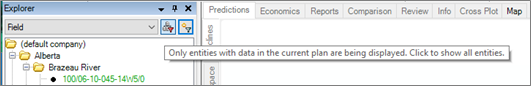

# 2017 v1.1 Release Notes

## Bug Fixes

- Fixed a crash when upgrading databases with multiple archives.
- Fixed a graph scaling issue where the Windows 10 Creators update
  caused some graphs to render as empty.
- Updated the Quick Plan Input hierarchy filter so that default inputs
  in system plans (Working, Pending, Accepted) are not considered as
  plan inputs.

