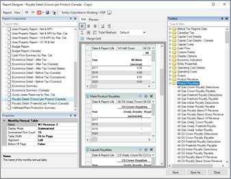
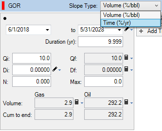
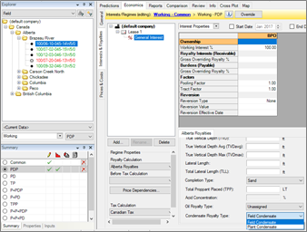

# 2017 v2 Release Notes

## Features

The focus of 2017 v2 is calculation performance, royalty detail
reporting, and Arps ratio forecasting.

### Calculation Performance

A major focus of work in 2017 v2 was to realize significant performance
gains in Value
Navigator. We have improved the calculation framework to take
advantage of hardware configurations in client PC’s that can result in
economic runs up to 75% faster than in previous versions.

Some of these improvements are configurable based on hardware
specifications. For further information on 2017 v2 performance features,
please contact 3esi-Enersight Support.

### Royalty Reporting

We have added per-product detail on royalty results. Users can now
report a detailed breakdown of royalties by product before and after
deductions. Royalty rates are now reported as a rate based on royalty
pricing, if necessary, instead of sales pricing.

Two new reports are available: Royalty Detail (Crown) per Product and
Royalty Detail (Freehold) per Product. These are also available as
templates in Report Designer so users can access all per-product royalty
fields.

Added the per-product royalty fields to the Fiscal Regime editor as
formula variables:

- Royalty Revenue Summary fields (ex. Gross Royalty Basis Revenue)
- Per-product Royalty Revenue fields (ex. Gross Oil Royalty Basis
  Revenue)
- Royalty Paid Summary fields (ex. Total WI Crown Paid)
- Per-product Royalty Paid fields (ex. WI Oil Crown Paid)

### Ratio Forecasts

Improvements to forecasting to support database conversions and SAGD
workflows.

### Conversions

Some forecasting software products support time based ratios (i.e. %
over time rather than % over volume). This caused issues when converting
databases from these products to
Value
Navigator because forecasts based on % over time were not
supported.

Start/End Dates - SAGD

Start and End Dates are now available for all ratios. End Dates were
added to ratios to facilitate forecasting the entire SAGD lifecycle;
that is, the ability to forecast early stages of a SAGD project using
steam and SOR forecasts, then switching to oil and other injectant
forecasts after the steam phase.

## Enhancements

### Field Condensate vs Plant Condensate – Alberta

Users asked for the ability to designate wellhead condensate as plant
C5+ for Alberta royalty purposes. There is a new option to designate
wellhead condensate (or unassigned oil) as either Field Condensate or
Plant Condensate. Plant Condensate will be evaluated using the C5+
royalty calculation.

### Allow users to customise minimum Y-axis values for graph scaling

Users can now specify both minimum and maximum Y-axis values to provide
consistency with graph scales. Previously only the maximum was
configurable. Configure the values from the Predictions tab graph
context menu: Graph and Scaling Options \&gt; Custom Y Axis Scaling.

### Licensing Improvements

Several improvements to the license web services result in better
diagnostic and logging tools.
Value
Navigator users get more user-friendly error messaging and more
detail in log files, and licenses are released on errors rather than
being used.

Support for Unicode characters has been added.

### Rebranded the NavPort data import as RS Prism

In 2016, RS Energy Group acquired the production and completion data
company NavPort. The NavPort .vna file import has been updated in
Value
Navigator and is now referred to as RS Prism as a Data Source and
Vendor ID.

### Added Command Line production update capability

Ctrl+Shift+Right Mouse Click in the 2017 v2 install directory has the
option ‘Open Powershell window here’ or ‘Open command window here’.

A command line instruction can be run from this window to update
production values in a specified project.

### 3esi-Enersight Data Integration

Energy Navigator was acquired by 3esi-Enersight in June 2017.
Significant work has been done since to integrate
Value
Navigator into the 3esi-Enersight suite of products using data
migration tools in the form of plug-ins. 3esi-Enersight products have
been added to the Vendors list (Administration \&gt; Vendor IDs)

Please contact 3esi-Enersight Support for a complete list of available
plug-ins as these will be made available over the coming months.

## Bug Fixes

### Technical

- Fixed a forecast error that could occur with dependent ratio
  forecasts. In the case where there are two ratios, and one ratio
  depends on a product calculated from another ratio, there should be no
  error. Previously, an error message was displayed ‘There are not
  enough product forecasts’ and the dependent ratio was not calculated.
- Removed the Ei field from Predictions \| Workspace data grid. This was
  a redundant field from previous versions of best fit routines, and the
  value reported had no meaning.
- Fixed an issue where 1+WOR declines alone could not be created from
  the Best Fit/Refit dialogue. It is valid for an oil well to have only
  a 1+WOR forecast, which also forecasts oil.
- Fixed an issue where inactive 1+WOR declines were being calculated
  which resulted in a performance loss. This could occur if a 1+WOR
  decline automatically became inactive through the addition of a WOR
  decline.

### Economic

- Fixed an issue where Fiscal Regime inputs reverted back to original
  values. This could occur if the value on an input control was returned
  to a previous value. Other inputs would also revert back to original
  values.
- Fixed an issue where a Gross Overriding Royalty with Operating Cost
  deductions was not calculated as expected. The Operating Cost was not
  being factored for the cap percent.
- Reporting and Graphs
- Fixed a crash that could occur in the Declines \| Workspace tab
  “System.ArgumentOutOfRangeException”. This could occur when a graph
  was generated in the workspace with element names longer than 32
  characters.

### Other

- Fixed an issue when a Default scenario (Project Options \&gt; General)
  that was not \ was not displayed by default in the
  Comparison \| Economic tab.
- Fixed an issue where grid values were not displayed as expected. If a
  data grid Display Mode was set to Monthly and sparse data inputs (i.e.
  Operating Costs) had different date ranges, the grid might not display
  all values.
- Fixed an issue where project hierarchies could be dropped from the
  project. If a User Hierarchy was edited to be a Project Hierarchy, it
  was not saved to the database.
- Fixed an issue where connections failed for SQL Server databases with
  periods in the instance name. 'INVALID_SERVER_CHARACTERS' need to be
  changed to "\[^A-Za-z0-9\_\\-\\.\]"
- Fixed an exception that could occur when opening a SQL Server
  database. Under certain conditions, project databases were created
  with a deprecated data type ‘ntext’. This has been updated to
  ‘nvarchar’.
- Fixed an exception that prevented databases being created from XML
  imports. This could occur when Batch Definitions with reserves
  categories equal to Common were included in the XML.
- Fixed a crash that could occur when creating a new Schedule entity.
  This could occur when using Entity \&gt; Create \&gt; Empty Schedule.
- Fixed a crash that could occur when editing dropdown field values.
  This could occur when toggling values in enforced lists with the
  keyboard.

## Plug-ins Included with the Release

Many of our clients have been using plugins to augment specific
functionality in
Value
Navigator. We have included three of our most popular plugins
with the download for 2016. Descriptions of these plugins are below. If
you wish to use any of these in your company, they must be loaded
manually for each user who wants to use them. Contact Support for
assistance with this.

PlugIns, and their accompanying documentation, available in the folder
are:

- **Schedule Adjustment**: Changes the timing of the forecast start
  date, capital costs, and operating costs, while maintaining the time
  relationships between costs.
- **Delete Production**: Deletes historical production that may have
  been imported incorrectly.
- **Edit/Delete Change Records**: View all current change records in a
  database and delete them or edit their properties.
- Note that workflows previously handled by the Working Interest Import
  Plugin can all be accomplished in
  Value
  Navigator using the Spreadsheet Import and Data View tabs, so
  this plugin will no longer be supported.

Note that workflows previously handled by the Working Interest Import
Plugin can all be accomplished in
Value
Navigator using the Spreadsheet Import and Data View tabs, so
this plugin will no longer be supported.

## Known Issues

If you are connecting to an Access database to import External Data into
Value
Navigator, you will not be able to do this with the 64-bit
installation. 64-bit compile will not support connections to Access
currently. If you run into this issue, please contact Support and let
them know to pass this on to Development so we can determine if a fix is
required for this issue in future releases of
Value
Navigator.

Please visit [Quorum.com/support](https://aucerna.com/support/) to for support.
