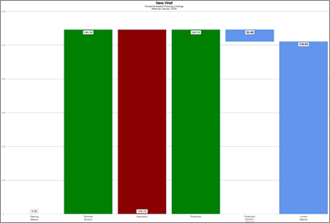
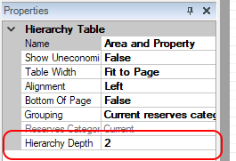
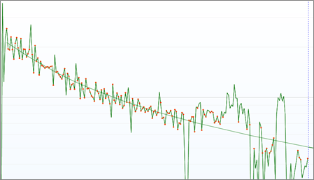

# 2018 Build 14 Release Notes

## Installation Changes

As of version 2018,
Value
Navigator no longer supports a 32 bit installation.

## Schema Changes

See the *Database Administration* folder of the release package for
schema changes.

## Upgrade Changes

- Modified database upgrade procedure to automatically turn off query
  timeouts. This enables very large database upgrades to succeed without
  requiring config file changes.
- Added a cleanup query on upgrade to remove orphaned records in the
  ENT_RELATIONSHIP table.

## Features

### Automated Reserves Reconciliation

We’ve added [automated reserves
reconciliation](../Reserves%20Management/Automated%20Reserves%20Categories/Automated%20Reserves%20Reconciliation%20Overview.md)
(ARR), which is designed to simplify reconciliations by eliminating the
need to manually create a change record each time you modify an entity.
With ARR enabled,
Value
Navigator detects the changes you made and creates the required
change records when you click Reconcile (on **Review \| Change Records**
or **Review \| Waterfall**).

Automated reserves reconciliation is enabled by default in any project
created in
Value
Navigator 2018 (you can still create change records manually
using the Balance button). However, ARR is not enabled by default in any
project upgraded to
Value
Navigator 2018 or later. For upgraded projects, you must enable
ARR in the project options.

You can only enable ARR on upgraded projects with data in the Accepted
plan

### Reserves Category Transfer Tool

We’ve add a [Category Transfer
tool](../Reserves%20Management/Manage%20Reserves%20Data/Transfer%20Reserves%20Category%20Data.md)
to the Data Manager (**Entity** menu \&gt; **Data Manager**).

The Category Transfer tool simplifies the process of copying a well from
one reserves category to another (from PUD to PDP, for example).

The tool:

- Transfers the entity from one reserves category to another and removes
  the inputs from the source category
- Creates a change record for the transfer
- Creates a change record for the revisions
- Balances the entity before or after the transfer, depending on the
  option you select

### Waterfall Chart

We’ve added a [Waterfall
chart](../Reserves%20Management/Automated%20Reserves%20Categories/Compare%20Reserves%20Balanaces%20on%20the%20Waterfall%20Chart.md)
(**Review \| Waterfall**). The chart displays opening balances, changes,
and current reserves balances in a waterfall format. The chart displays
entity or folder level results.

### Secure Plans

We’ve added the ability to
[mark plans as secure](../Entity%20Management/Plans/Secure%20Plans.md).
We’ve also added a supporting security policy called Edit Secure Plan
Data for assigning permission to users. This policy can be edited to
specify which secure plans the user or role has permission to edit.

### Sandbox Plan

We’ve added a built-in [Sandbox
plan](../Entity%20Management/Plans/Sandbox%20Plan.md) for “what if”
scenarios.

This plan does not participate in the reserves process. The Sandbox plan
is always a top-level plan. You cannot delete it or make it secure.
However, you can add child plans to it.

There is a Copy to Sandbox menu item under the Entity menu. You an copy
entities or folders to the Sandbox from other plans. When you copy to
the Sandbox, any corresponding entity or folder level data already in
the Sandbox is overwritten.

## Enhancements

### Gross Change Records

We’ve added a Gross basis to the list of ownership variants for which we
capture and report change record data. Also known as ‘eight-eighths’, it
is required for EIA 23 disclosures in the United States and helps give
you a more complete version of your reserves.

### Gross values are tracked with both the Balance command and the new Reconcile command.

Databases that are upgraded to
Value
Navigator 2018 will not have gross opening balances created on
any wells. Gross opening balances can be imported via the Spreadsheet
Import, if desired. If not, the first change records created after the
upgrade will capture the full current value of the well on a gross
basis.

### Hierarchy Depth in the Report Designer

We’ve added Hierarchy Depth to Hierarchy Tables in the Report Designer.
This enables you to control the level of aggregation in the
hierarchy-based reports.

### Display Auto-fit Source Points in Custom Graphs

We’ve added an Auto-fit Source Points display option to custom graphs.
This option displays the auto-fit points on the source data rather than
on the fit line. This option has not been added to the default graphs.

### Control Auto-running Reports

We’ve added an Auto-run option to the **Reports** tab. When deselected,
reports are not automatically run when you click the Reports tab.

## Other Enhancements

### User and Project Options

- Added a new project option to display or hide report page borders.
- Added a new project option to display or hide report titles.

### Reports

- Added the Root Group field to all entity-level custom reporter
  queries.
- Added new option for the Change Record Summary and Reserves
  Reconciliation reports to show oil and gas reserves product details or
  show only rolled-up 'All Oil' and 'All Gas' variants.
- Added a new option to the Change Record Summary report to include
  condensate volumes in the liquids, including the liquids summary when
  details are not shown.

### Interests and Royalties

- Revisions to Saskatchewan gas royalties:
  - Formerly, royalties would calculate on sales gas & liquids – now
    only calculates on raw gas
  - Added new royalty price stream for PGP, in \$/energy (i.e., \$/GJ or
    \$/MMBTU) – previous price was only in \$/volume (\$/Mcf or
    \$/103m3). If new price is not populated in the price deck, will
    fall back to volume-based pricing.
  - Formerly, gas royalties would be valued based on the wellhead sales
    price – now valued based on the PGP, accounting for the raw gas
    energy content
  - Other tweaks to royalty rate calculations (e.g., handling PGP below
    the \$1.35/GJ Kg formula threshold, per PR-IC02 secction III (f)).
- Condensate now included in BC PCOS calculations.
- BC PCOS deductions are now limited to 95% of the gross royalty.
- Input Copier has new selections for Reserves Category Royalty
  Properties and Reserves Category Tax
- Updated Alberta meter station factors for 2018, per Information Letter
  IL-2018-09.

### Miscellaneous

- Added a the Well Detective to the main toolbar (previously only in the
  Tools menu).
- Updated the behaviour of the Project Start Date, such that
  modifications to the project start will only be carried through to
  parallel rescats if the parallel start dates are in sync (i.e., the
  same as the date being revised). This will better support having
  separate 1P/2P/3P schedules when using our new behind-pipe scheduling
  plug-in.
- Updated the Update/Delete Change Records plug-in to support change
  records generated as part of automated reconciliation.
- Added Release Notes for
  Value
  Navigator versions 2016 to 2018 to the Help (Help menu \&gt;
  Contents or press F1).

## Bug Fixes

### Technical

- Fixed a crash on the Declines tab when attempting to draw a decline
  profile on a series with no points.
- Fixed an error in the auto-fitting routines that could sometimes cause
  a crash.
- Fixed an issue with 1+WOR declines used in concert with O+W constant
  values, where the 1+WOR ax rate was incorrectly used instead of the
  O+W constant rate.
- Fixed an issue on the Plant tab, where imported liquids history would
  not be used if a default liquid extraction (ratio or efficiency) was
  entered.

### Economic

- Fixed an issue where moving forward the reference date (and thus the
  discount date) would cause NPV amounts on the Change Records tab to
  not include current period values (i.e., the amount between prior
  posting and reference date).
- Fixed an issue where wells that went uneconomic between the economic
  calculation date and the reference date would not have any values on
  the Change Records tab. They will now have the values for the period
  of time between the prior posting date and their economic limit. This
  will also impact dispositions modeled with an interest end date.
- Fixed an issue when copying incremental capital or operating costs
  between plans or reserves categories, where the costs could be doubled
  in the destination.

### Miscellaneous

- Fixed the Open as spreadsheet functionality to prevent occasional
  failures to open spreadsheets if Excel was already running.
- Fixed an issue where external data source files would be seen as
  invalid if they had uppercase file extensions.
- Fixed an issue where editing CTE options would not cause values on the
  Change Record tab to be updated.
- Fixed the Generate forecast from last production month import user
  option, which previously would generate from the current month when
  checked, and last production month when unchecked, which was
  backwards.
- Fixed MRF wells with liquids extraction where
  Value
  Navigator would sometimes have used the inlet composition for
  C5, C6, and C7+ in determining gas energy content. It will now
  correctly use the step outlet composition, with these products
  adjusted for C5+ extraction as modeled on the Plant tab.
- Updated the XML import to resolve certain classes of name conflicts,
  where a well with the same UWI was created separately in two databases
  and then imported between them. Previously, it would reject the import
  but now will give the duplicate well a safe name and bring it in. This
  applies not just to wells, but to all entities (well, groups, type
  wells, schedules, etc.).

## Included Plug-ins

Many of our clients have been using plugins to augment specific
functionality in
Value
Navigator. We have included four of our most popular plugins with
the download for 2018. Descriptions of these plugins are below. If you
wish to use any of these in your company, they must be loaded manually
for each user who wants to use them. Contact Support for assistance with
this.

Plug-ins, and their accompanying documentation, available in the folder
are:

- **Schedule Adjustment**: Changes the timing of the forecast start
  date, capital costs, and operating costs, while maintaining the time
  relationships between costs.
- **Delete Production** Deletes historical production that may have been
  imported incorrectly.
- **Edit/Delete Change Records**: View all current change records in a
  database and delete them or edit their properties.
- **Behind-pipe Scheduling**: Reschedule a set of wells, in sequence,
  such that each well’s start date is synchronized with the prior well’s
  economic limit.

## Known Issues

If you are connecting to an Access database to import External Data into
Value
Navigator, you will not be able to do this with the 64-bit
installation. 64-bit compile will not support connections to Access
currently. If you run into this issue, please contact Support and let
them know to pass this on to Development so we can determine if a fix is
required for this issue in future releases of
Value
Navigator.

Please check the Client section of our website,
[www.energynavigator.com/clients](http://www.energynavigator.com/clients), for updates on this
and other important information
