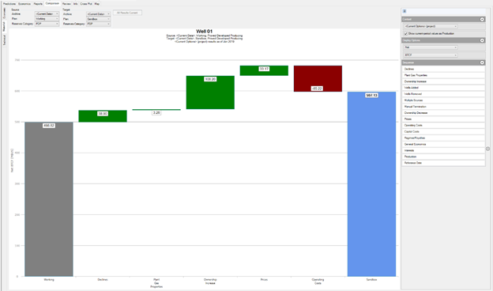
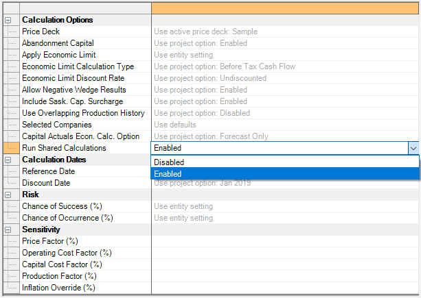
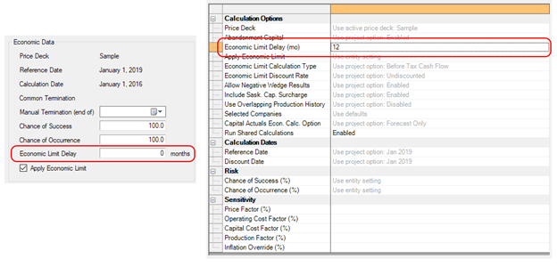
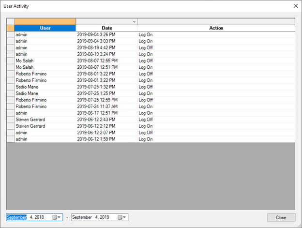
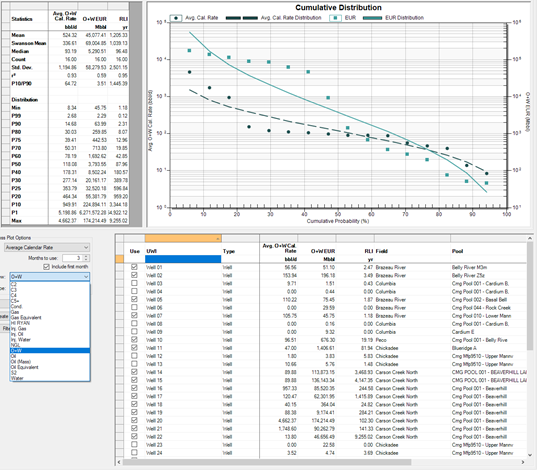

# 2019 v2 Release Notes

## What's New

### Waterfall Comparison tab

For VN 2019 v2, we’ve taken our automated reconciliation logic and
applied it outside of the reserves world. On the new Comparison \|
Waterfall tab, you can run a reconciliation on any well or folder and
see the differences against any other version of that well. You an
compare different reserves categories, plans, or archives to see how
wells or fields are changing over time and quickly re-sequence the
calculation to explore sensitivities.

### Run a Scenario without Shared Calculations

VN 2019 v2 adds a new scenario option to bypass shared calculations
(common termination entities and ring fences). This will facilitate a
better work flow when attempting to see the individual well impact of
input changes.

### Economic Limit Delay

VN 2019 v2 has a new well-level input to enable delaying the
consideration of economic limit for a certain number of months beyond
the reference date. This enables you to better handle certain classes of
uneconomic properties, such as wells drilled with overspends or the
drilling of uneconomic wells to preserve acreage. This option is
available both at the well level and in scenarios.

### Login Auditing

Value
Navigator will now keep a record of user login/logout activity
for security and usage auditing purposes.

### More Products in Cross Plots

Cross plots have been expanded to work on all product data, not just oil
and gas. Now you can also look at your wells in terms of condensate or
NGLs.

## Other Enhancements

- Added the ability to import producing hours using the days unit in the
  Spreadsheet Import
- Updated the Batch Manager to run batches in alphabetical order if
  multiple are selected. Previously there was no guaranteed order
- Added oil density to miscellaneous other areas of the application:
  decline quick fields, Economics \| General quick fields, Properties
  tool window, and filters.
- Updated the Well Detective to set focus into the well list grid; this
  will allow faster pasting of well lists without using the mouse
- Updated the cloud-based licensing system to more quickly handle
  license revocations. Previously would take approximately 1 hour; now
  will be no more than the keep-alive period (11 minutes maximum)
- Updated the Rate/Time - Semi-log, Multi-Axis graph to remove data
  collision avoidance to prevent closely spaced data points being
  hidden/merged
- Updated default well inputs so that new Alberta wells get the
  Modernized production category and incentive
- Updated the economic calculation to properly include Oil (Mass) at all
  points in the calculation and reporting
- Added Oil (Mass) bubble sources to the map
- Added the ability to disable shared calculations (common terminations
  and ring fences) via a scenario option
- Updated the licensing to better work with roaming profiles
- Added the ability to suppress the built-in decline graph background
  gradient
- Added the ability to enter operating costs in currency millions (MM\$,
  etc.)
- Updated the price set builder dropdowns to support price streams with
  long names

## Bug Fixes

- Fixed an issue in type wells, where recalculating a history + forecast
  type well would auto-fit a forecast. It will no longer fit at all, and
  if an existing forecast is present it will be preserved.
- Fixed an issue where entering large abandonment amounts on the
  Economics \| General tab (particular in non-dollar currencies) would
  store an incorrect number
- Fixed a crash in the Products dialog when adding new products and a
  new product list at the same time
- Fixed a crash on type wells when displaying the built-in Status
  Rate/Time or Status Rate/Cum graphs
- Fixed the Co.Share Oil + Condensate column on the Wellhead/Plant
  Production Summary report. Previously this was reporting WI volumes
  instead of Co. Share
- Fixed an issue in the Spreadsheet Import where having oil density in
  metric units could cause a crash
- Fixed a crash on some computers in getting the machine ID to use for
  licensing
- Fixed a issue where reserves (jurisdiction) calculations would ignore
  the capital forecast/blended economic option
- Fixed an issue in the GCA calculation where depreciation could be
  calculated once per product not once per step
- Fixed an issue in the licensing where a service timeout would corrupt
  the license file; this would prevent the grace period from working
  correctly
- Fixed an issue where removing price decks wouldn't work if you clicked
  the Save button before the OK button
- Fixed an issue in the group and rollup calculation where modifications
  to liquids yields at the well level wouldn't be captured when
  recalculating a group
- Fixed a crash that could occur in the Decline Workspace with long
  forecast names
- Fixed an issue where a jurisdiction change record sequence would not
  import correctly from XML files
- Fixed an issue in the automated reconciliation where having different
  reference and discount dates could yield unexpected results
- Fixed an issue in the automated reconciliation where certain
  incremental forecasts could yield an incorrect decline calculation
  during the reconciliation
- Fixed a calculation failure that could occur with incompletely
  specified royalty prices in the price deck
- Fixed a crash with additional classes of Oracle failures
- Fixed a crash that could occur when quitting the program
- Fixed an issue where custom reserves category names would not be
  exported when exporting straight to a new .vndb file
- Fixed an issue on the cross plots tab where the P10/P90 ratio would be
  incorrectly displayed in metric units mode
- Fixed a crash on the Review \| Waterfall tab when all jurisdictions
  are disabled .
