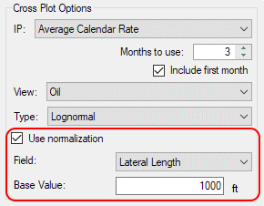
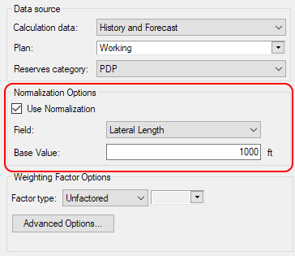
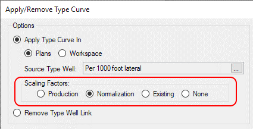
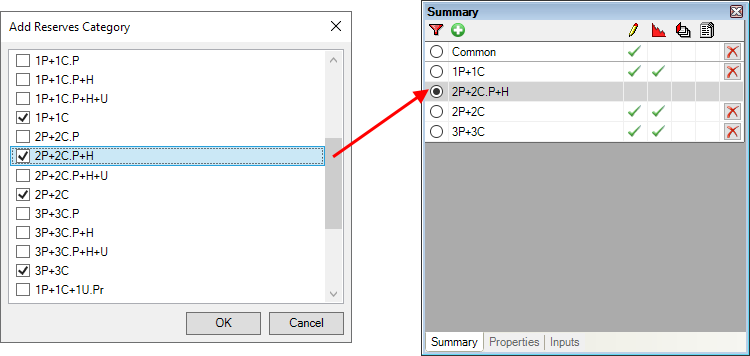

# 2020 Release Notes

## New Custom Reserves Categories

Val Nav 2020 adds the ability to fully customize your reserves
categories, including all the components, relationships, groups, and
resource classes. Val Nav will now support complex models with
contingent and prospective resources, such as a full PRMS model or
company-specific variants thereof, but will also allow simplification –
planning groups who don’t split PDP and PUD wells, or SEC-reporting
clients who don’t need a P+PDP forecast, can remove any unused
categories and go forward with simpler models.

### Why custom reserves categories?

Custom reserves categories allow us to address several client-requested
features:

- Contingent/prospective resource tracking – By allowing users to extend
  the reserves category system, we can capture contingent and
  prospective resources in a more first-class manner. This can be a
  simplified model (only track contingents, not the sub-classes), or can
  go down to a full PRMS model.
- Split PUDs and DUCs, and other sub-classes – With completion costs
  comprising a larger proportion of well capital, some clients wish to
  split their current PUDs in two classes: true undeveloped PUDs, and
  DUCs (drilled uncompleted). Custom reserves categories support this,
  as well as the behind-pipe/shut-in splits for PDNP classes.
- Simplified setup for SEC reporting – Those reporting to the SEC do not
  necessarily need or want the full set of built-in Val Nav categories.
  You can now model a simpler system where you have Probable and
  Possible categories but not the other increments (P+PDP, P+PUD, etc.).
- Alternate systems – Custom reserves categories allow us to support
  alternate systems of any kind. This can be simplified planning systems
  (e.g., a single ‘Forecast’ category, or simple ‘Low-Best-High’),
  internal contingent systems that are variants of PRMS, an ‘AFE’
  category for snapshotting approvals, and so on.

The fundamental modeling method of Val Nav has not changed: Val Nav
still requires that you model on a ‘total’ or ‘cumulative’ basis (TP,
not PUD). The configuration to change this exists in the reserves
category dialog (each reserves category has an ‘Allow Input’ flag), but
this is expected to be restricted in the full VN 2020 release and
activated in 2020 v2 instead.

See
[Configure Reserves Categories](../Reserves%20Management/Configure%20Reserves%20Categories.md) for more
information.

### New Reserves Category Features

Most of Val Nav will look and feel the same if you customize your
reserves categories – you’ll just see a longer (or shorter) list in most
places.

Note that PNP has been renamed PDNP.

### New Summary Panel

The summary panel (or ‘rescat window’) in the bottom left of the
application is now filterable. With certain models (e.g., a full PRMS
model) the number of categories to work with can be extensive. To make
it easier to work with, we have added a new filter mode, which filters
the list down to only those categories with inputs:

In this mode, a new Add Reserves Category button appears, to offer a
convenient way to add new data to the well:

### Reserves Category Reporting

Changes to reserves categories will also flow through to reporting. The
reports tab and batch manager will let you reference more wedges/related
variants:

And report content can extend to additional reserves categories:

### Balancing and Reporting Reserves

For reserves use, the primary change is around jurisdiction
configuration. We split the ‘Reserves Categories to Balance’ option in
two: Reserves Categories to Balance, and Reserves Categories to
Disclose. This supports workflows where internally companies track
resources through to contingent and prospective, but only disclose
Proved or Proved + Probable.

The disclosure option will primarily impact the categories shown on the
reports accessible from the Reserves menu, particularly the NI51-101
reports.

All reserves reports have been updated to support alternative reserves
category configurations. This may result in minor layout changes (for
instance, the Change Record Summary report may now stretch horizontally
across multiple pages if you are balancing contingent categories).

### Transferring Category Data

The category transfer dialog has been revised to be more flexible.
Instead of a fixed list of predetermined transfers, you can now transfer
any category to any other, including “untransfering” (e.g., moving a PDP
to a PUD). Where applicable, you can still choose to transfer in
parallel, meaning your 1P/2P/3P (or 1C/2C/3C and 1U/2U/3U, if you choose
to use contingents) can all be moved together.

## New Type Well Normalization

Val Nav 2020 extends the capabilities of our industry-leading type well
tools by adding normalization – scale the analog wells of a type well
before calculating the average, and afterwards scale the type well
profile back on individual wells to account for completion design.

The ability to normalize means you can expand your population of analog
wells. A larger set will yield a more reliable type well. The ability to
scale it back to well parameters makes it simple to capture a more
accurate forecast for your development plan, or to compare individual
wells against their peer average.

Start by looking at normalized data on the cross plots tab to get a
statistical look at your sample set and choose appropriate analogs:

You can normalize on any numeric field, whether built-in or one of your
project’s custom fields.

The same is then available when creating a type well:

This will flow through to all type well capabilities, including the
weighting factors and aggregation type well calculation, and any graphs.
Here, the normalized plot is on the right:

When applying the type curve to wells, you can now scale it based on the
normalization, whether in bulk (**Tools \&gt; Apply/Remove Type Curve**):

Or on an individual well:

0

## Commingled Groups

To better support certain workflows with commingled production, we have
introduced some new capabilities to the group calculation. Groups will
now aggregate capital from the child wells, and a new ‘Commingled’ flag
has been added to groups that changes the well count calculation from a
SUM to a MAX.

This will allow better behavior for commingled wells around the
scheduling of additional completions – the summation of capital means
you can keep the completion capital at the well level, and use the
project start to move both production and capital in time, and the
change to well count means that you will no longer see artificially high
well counts at the group level and the corresponding over-allocation of
fixed operating costs.

## Fit Secondary Ratios

Val Nav 2020 has extended its auto-forecasting algorithm to secondary
product ratios, such as gas-oil ratio (GOR), water-oil ratio (WOR),
condensate-gas ratio (CGR) and any other built-in or custom-defined
ratios for which declines are permitted. This adds yet another level of
sophistication and efficiency to Val Nav’s industry-leading capabilities
for decline curve analysis and forecasting workflows.

These fits can be triggered in a number of ways:

- Manually alongside regular product fits via the fitting dialog
  (Predictions \&gt; Best Fit and Predictions \&gt; Refit)

4

- Via graph interactions (alt-click, ctrl-click, etc., or via
  right-clicking)

- On import of production data

6

Fit options are available in the user options (Tools \&gt; Options \&gt; User
Options):

## Security on the Working Plan

We have extended plan security to the Working plan in Val Nav 2020. This
ability to mark Working as only editable by certain users will
facilitate better sharing of databases between multiple groups (e.g.,
Reserves and Planning).

## Command-line Spreadsheet Import

We have added command-line parameters for executing imports of
spreadsheet data. This extends the existing ability to schedule/automate
the import of all types of data, from declines and forecast arrays to
ownership and operating costs. This will allow for superior data
integration and greatly reduce the need for manual workflows for
bringing data in to Val Nav.

## Important Schema Change

With the introduction of custom reserves categories, there were some
schema changes required. Of particular note is the changing of the
reserves category IDs from numeric to string values: new reserves
categories will have GUIDs, while the existing categories keep their IDs
but in a different data type (e.g., for PDP, the numeric key 1111 will
become the string “1111”).

Any integrations or queries against the database may need to be updated.
Joins should be fine, but any explicit filtering on reserves category
will need to be updated to use the string form of the ID.

Other schema changes are documented separately in the beta download
package or click
[here](../Schema%20Changes/VN%202020%20schema%20diagram.pdf).

## Bug Fixes

The following bugs were fixed in
Value
Navigator2020:

- Fixed an issue on the Verify Balance report where wells could be
  sorted in a different order than in the hierarchy.
- Fixed an issue in the auto-reconciliation where a crash could occur if
  a plan existed in current data that did not exist in the reserves
  archive.
- Fixed an issue where the hierarchy filter for current-plan entities
  would show wells with no inputs in the current plan.
- Fixed a crash that could occur in the Decline Workspace when
  viewing/editing a type well link.
- Fixed an issue with daily fitting where the forecast would sometimes
  not honour the current month/last production month user option.
- Fixed an issue where daily pressure data would not plot on cumulative
  graphs in the absence of monthly data.
- Fixed an issue in the decline fitting where the decline parameters
  could be set to match the max technical life project option instead of
  the real limit of the well.
- Fixed an issue where an invalid jurisdiction change sequence would
  yield invalid XML exports. Exported XMLs will now be in a valid form
  even if the jurisdiction is invalid.

## Enhancements

The following enhancements were implemented in
Value
Navigator 2020:

- Updated reserves category identifiers to use a string instead of a
  numeric ID
- Reserves category definitions can be now included as part of external
  project data
- Updated sort ordering of reserves categories throughout the
  application to respect that configured in the reserves category
  configuration in global project data. This may yield some changes to
  sort order in certain reports.
- Updated database storage for type wells to key data by a new "entity
  rescat" instead of always in PDP (since PDP is no longer guaranteed to
  exist).
- Added a validation step to XML imports, such that imports of reserves
  category configuration that would result in the deletion of existing
  reserves category inputs will be prevented. Reserves category lists
  must be aligned/compatible before imports can proceed.
- Updated the Wedge/Total labels on the Review\|Waterfall tab to reflect
  that change records can now be configured to store results for
  non-wedge categories.
- Renamed "PNP" in default reserves categories to "PDNP". Note that this
  will not impact upgraded databases which will keep 'PNP" name.
- Updated some product default fit settings alongside new default fit
  settings for fittable ratios.
- Updated default graphs to include autofit series for fittable ratios.
  Any custom graphs are not upgraded in this manner and will have to be
  manually adjusted to include the new fit information.
- The spreadsheet import can now be used to import forecast arrays and
  decline parameters for type wells. This previously was only possible
  for wells and groups.
- Changed the default user option for default Oracle tablespace to
  VALNAV_DATA from USERS.
- Changed the economic calculation logic of child plans to remove the
  fallback logic. Previously, uneconomic results in a child plan would
  fall back to parent plan results. Child plan economics are now treated
  as fully independent of the parent.
- Added a new project option (in Project Options: General): Default
  forecast mode. This will enable you to configure if newly created
  wells and groups will be in Total or Incremental mode. Previous
  behaviour was to always default to Incremental mode.
- Added a new project option (in Project Options: General): Last year
  for technical monthly output. This allows configuring a different
  monthly/annual split in database results between technical data and
  economic results, with the goal of improving the accuracy of group and
  rollup calculations without compromising existing economic result
  configuration.
- Introduced two new Custom Reporter variables:
  LastYearForEconomicMonthlyOutput and
  LastYearForTechnicalMonthlyOutput. Reports using the previous custom
  report variable LastYearForMonthly will continue to use the economic
  setting.
- Updated the decline calculation for volume-based ratios, to allow
  certain calculations to proceed that previously could not be solved.
- Added Oracle 19c to the list of supported database versions.
- Added extension points to the Val Nav extensibility API to support
  plug-ins providing alternative break-even analysis logic
