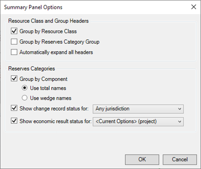
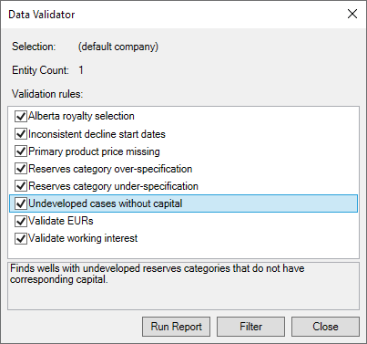
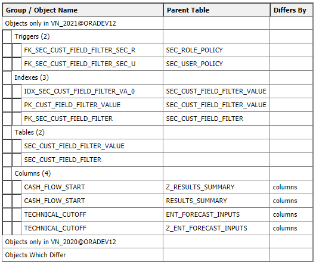

# 2021 Release Notes

## New Features

### New Input Functionality: Inputs on Wedges

Val Nav now supports directly inputting into the wedge reserves
categories. Where Val Nav historically only supported inputs in the
total categories (PDP, PD, or TP, for instance) it now supports the
direct use of the wedges such as PDNP and PUD.

This functionality opens up new workflows for workover modeling and
group-level forecasting, where you can now carry discrete development
increments:

- Put your PUDs, DUCs, or PDNPs directly in their categories.
- Capture a workover as the pure increment.
- Model new development in a field-level forecast in its own category
  instead of composing a total forecast

It also means you can align the software to better match industry
language, reducing day-to-day friction, shortening the learning curve,
and allowing easier on-boarding of users from other systems.

Val Nav 2021 offers this great new flexibility and makes no compromises
in the deep sophistication of the existing system: category fallback in
rollup calculation, automatic total and wedge determination in economic
results, full contingent resource modeling, and more.

Read more [here](../Enter%20Data%20on%20a%20Wedge.md).

### Enhanced Summary Panel

With the addition of inputs on wedges, and thus a greater number of
potential input rescats, the summary panel ("rescat window") was updated
extensively. It offers new capabilities to ease navigation: group by
resource class or reserves group, filter to inputs, control the
economics and change record indicators, and more. Read more
[here](../Entity%20Management/View%20and%20Organize%20Entities/Use%20the%20Summary%20Properties%20and%20Inputs%20Windows.md).

|                 |                 |
|-----------------|-----------------|
| 

 | 

 |

### New Data Validator

Val Nav 2021 introduces new data validation tool. This tool will scan
your entities for a variety of potential problems: missing capital, EUR
mismatches, out-of-sync start dates, and more. It can be found
under Tools \&gt; Data Validator in the main
menu. The tool can evaluate multiple rules simultaneously, and will
produce a report listing all flagged wells and the applicable rule(s) in
violation on those wells. It can also filter to the wells in question
for easy correction. Read more [here](../Validate%20Data.md).

## Enhancements

- Updated imports to log any detected
  [overspecifications](../Enter%20Data%20on%20a%20Wedge.md#Over-spe).

- Updated bulk editing tools to log any detected overspecifications.

- Updated the plant gas yield calculations to account for inputs on
  wedges. On a wedge, volumes and rates will be treated as incremental
  (i.e., added to any base production), but efficiencies and ratios will
  not be incremental and instead will be applied to total resolved gas
  production.

- Updated all Data Manager tools to account for inputs on wedges. Any
  actions resulting in over-specification will be logged.

- Updated the Adjust Dates tool so that developed-producing additional
  wedges (e.g., PADP, PSDP) will be skipped with the 'all except
  producing' option.

- Updated the Category Transfer tool to account for inputs on wedges:
  moving a wedge to a total will move resolved values. Moving a wedge to
  a wedge will move just the wedge inputs.

- Updated input and technical reports to enable reporting on inputs on
  wedges (e.g., Input Summary report, Decline Summary report, technical
  graph reports)

- Updated technical result reports to account for inputs on wedges
  (e.g., WI Volume report, Wellhead Production report, Stacked Technical
  Reserves reports)

- Updated the Calc Date Adjustment report to capture results for all
  inputs, including over-specified categories.

- Update the Reports tab reserves category list to include all
  appropriate/related reserves categories for the current reserves
  category selection.

- Updated the Timeline tab to account for inputs on wedges. Updated the
  Current/Total logic to find inputs in wedges or 'additional'
  categories and display/move appropriately. Over-specified inputs will
  not be shown.

- Updated the Timeline tab so that data will always be shown even in the
  absence of project start fields (though no entries will appear in the
  Gantt). Previously would not show data if no wells had a project start
  defined.

- Updated Comparison \| Technical tab to account for inputs on wedges.
  Will show all inputs plus appropriate totals where allowed in the
  reserves category configuration.

- Added support for v2.5 of Drilling Info (.dri) file imports.

- Updated all economic calculations to account for inputs on wedges.

- Updated group/rollup calculations to account for inputs on wedges and
  reserves category configuration. Groups and rollups will now calculate
  one reserves category per component, adhering to reserves category
  input configuration rules, and preventing over-specification at the
  group level.

- Updated Comparison \| Waterfall tab to
  account for inputs on wedges.

- Updated the Review \| Review Status tab
  to account for inputs on wedges. Predictions grid will show resolved
  values even where inputs have been made on a wedge.

- Improved the logging in the economics calculation service to clean up
  log messages about unused plug-ins.

- Added a reserves category template selection to the project creation
  dialog.

- Updated the group/rollup creation dialog to indicate which reserves
  categories will be calculated upon creation.

- Updated automated reserves reconciliation to account for inputs on
  wedges.

- Updated various custom reporter queries to account for inputs on
  wedges: oil volumetrics, gas volumetrics, production by rescat,
  production forecast, production reserves, reserves, history and
  forecast, etc.

- Updated reserves category configuration templates to include inputs on
  wedges where appropriate, including an 'SEC-style' template with
  inputs only on wedges.

- Updated the Input Copier to detect and
  log over-specified inputs as a result of using the tool.

- Added the Import from External Source permission to default Super User
  role.

- Updated the category transfer tool to account for inputs on wedges.

- Updated forecast and reserves cache tables to cache data for anything
  with inputs. This will not eliminate/resolve over-specified input so
  care should be taken in querying these tables for multiple rescats
  (or, use the Data Validator regularly to detect and clean up
  over-specified wells).

- Updated the Review \| Waterfall tab to
  account for inputs on wedges. Will now report change records in As
  Captured and Total form (previously: Wedge/Total) as the input
  reserves category can now diverge from the category against which the
  change records are captured.

- Updated the WI Volumes report to account for inputs on wedges.

- Updated Change Record reports to account for inputs on wedges. Moved
  these reports to the Reserves section of the reports tree.

- Updated Scenario Comparison report to account for inputs on wedges.

- Updated Well Reserves Summary report to account for inputs on wedges.
  May now show additional data depending on where inputs live.

- Updated Stacked Technical Reserves report to account for inputs on
  wedges.

- Added a new plug-in with custom economic and technical indicators
  (netback, recycle ratio, various IP ranges, capital efficiency, etc.).
  This plug-in is included with the download package of the software but
  not installed by default.

- Added the "Always apply delayed abandonment" field to Data Views for
  bulk edits.

## Bug Fixes

- Fixed an issue with producing-time graphs where well count, on-time,
  and hours series could be misaligned.

- Fixed a crash that could occur when adjusting the side-panel splitter
  in Data Views tabs.

- Fixed an issue where dropping down the main Plan selector under the
  entity hierarchy could cause the main application to lose focus and/or
  z-order if the list was displayed but no selection was made before
  clicking outside the list.

- Fixed an issue in the BC royalty calculation where an error could
  occur using the Deep Discovery Gas incentive with condensate
  production.

- Fixed a problem in the decline graphs where daily pressure field data
  points would sometimes not be displayed. Collision avoidance has been
  turned off for new graph definitions. Existing graph definitions
  already exhibiting the problem will need to be rebuilt, or the .vng
  file can be edited in a text editor to change any
  \ elements to false.

- Fixed an issue in the Create New Wells dialog where the column mapping
  list would expand to fill the entire vertical space of the monitor.

- Fixed an issue on the Bulk Well Generator \|
  Definition tab where the source well list would expand to fill
  the entire vertical space of the monitor.

- Fixed an issue with oil density on the Wellhead Production Summary
  Report for rollups or folders. Will now use a pure average of
  densities instead of a weighted-average of densities at the reference
  date, which could miss wells that ended prior to or started after the
  reference date.

- Fixed an problem in the shared results calculator (common termination
  entity or ring fence) where the calculation would fail with a 'Max
  iterations reached' error if the economic limit was configured to use
  a discounted stream.

- Fixed a crash that could occur in custom reports with very small
  margins.

- Fixed the after-tax payout calculation to better account for payouts
  inside the first tax year.

- Fixed an issue in the command-line spreadsheet import that could occur
  when importing a CSV file but still using the /sheet argument.

- Fixed a crash that could occur when applying a type well in the
  Decline Workspace a second time on the
  same well.

- Fixed an issue where the quick display fields on the declines tab
  would be blank when moving between databases with mismatched custom
  fields.

- Fixed an issue in the Custom Reporter where certain filter conditions
  would yield a "Cannot load filter values" error.

- Fixed a crash in the user options that could occur with very large
  values for the shut-in months setting. That setting is now limited to
  100 years (1200 months).

- Fixed the calculation of discounted after-tax payout, which was
  previously not applying the correct discounting factor.

- Fixed a crash in certain Canadian royalties that would occur if a
  negative value was entered for Allowable Months.

- Fixed an issue where some long field names would not work in Data
  Views for Oracle databases.

- Fixed an issue where tax pool balances would not be carried over on
  upgrade.

- Fixed an issue where cross plot data would be inconsistent between the
  tab and the report for children of type wells.

- Fixed a crash on the cross plot tab that could occur when changing the
  units selection for EUR values.

- Fixed an error that would prevent exporting forecast data to an XML
  file.

- Fixed a crash that could occur when adding comments to a type well.

- Fixed an error that could occur in reserves reconciliation if a
  current well did not exist in the archived reserves.

- Fixed an issue that could cause the Edit Custom Fields button to
  disappear from some Data Views tabs.

- Fixed a crash in hierarchy table (one-liner) reports that could occur
  when selecting the Common reserves category.

- 

## Schema Changes

 

