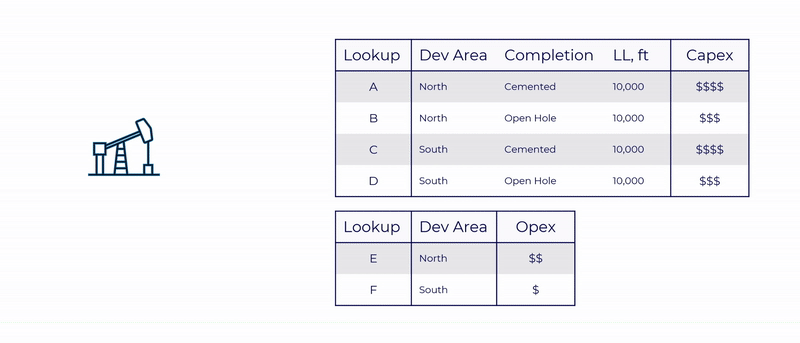
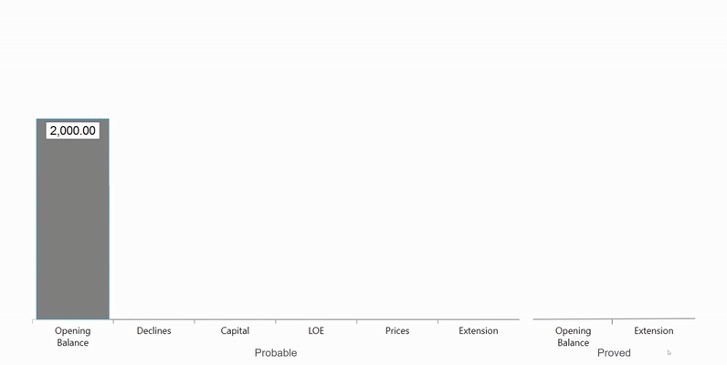
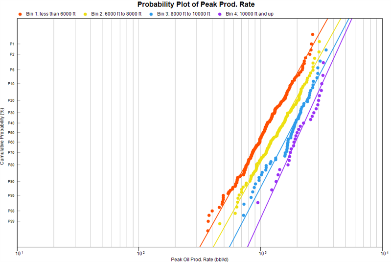

# 2025 Release Notes

## New Features

### Asset Evaluation with Decisions

Decisions act as a central control for your wells, distilling them down
to their critical economic drivers — like development area, completion
design and lateral length. Once set, Decisions automatically apply and
scale the appropriate lookups for both capital and operating cost,
simplifying inventory management, strengthening governance, and
accelerating scenario planning.

For a full breakdown of the new functionality, see [Decisions Overview](../Entering%20Economics/Enter%20Decisions%20and%20Schedules/Decisions%20Overview.md).

### Automated Transfer Reconciliation

Val Nav 2025 fulfills our vision of true, on-demand, asset-wide
reconciliation by making transfers fully compatible with auto
reconciliation. We’ve separated the act of transferring reserves from
the process of reconciling them, so you can:

- Reclassify reserves instantly—no economic calculation required at time
  of transfer
- Move faster, especially for shared calculations like ring fences
- Generate detailed, audit-ready transfer change records automatically
- Isolate the impact of forecast, price, cost, and other input changes

With this release, reconciliation isn’t a workflow—it’s a button. Run it
anytime, and get a fully reconciled asset when you need it, not just at
year-end.

### Numeric and Date Binning for Basin Analysis

Uncover the key drivers for well performance in you asset with numeric
and date binning support in multi-distribution plotting. You can now
split distributions across any data type to identify high-performing
analog sets and surface new insights.

- How much proppant intensity should define a new type curve analog set?
- What’s the true impact of parent/child relationships?
- Which operators or completion styles are leading the pack?
- Are newer wells consistently outperforming vintage ones?

### Significant Performance Boost for Well Updates

Val Nav 2025 brings targeted performance improvements to all well update
tools—from spreadsheet imports to data views to the Data
Manager—reducing friction in inventory updates and speeding up scenario
generation. The biggest gains show up in project upgrades and forecast
assumption changes, especially in large projects.

## Enhancements

- Extended the Map bubble plotting to plot custom economic indicators.
- Extended the Well Views - Economics tab to report custom Economic
  Indicators.
- Added a legend to cross plot tabs.
- Enhanced XML Import to handle imports of fiscal regimes with matching
  name but different object IDs.
- Added safeguards to disallow plan or reserves category definition
  editing while other users are in project or its unlocked.
- Introduce a new economic indicator to capture the average production
  rate at economic limit to surface marginal rates and validate proper
  terminations for Reserves.
- Introduced an MSIX installer format for simplified Azure VDI
  deployments.
- Increased transparency by surfacing invalid jurisdictions at time of
  reconciliation.
- Extended support of database-driven production loads to all sources
  (Access, Snowflake, Databricks, etc.) with generic ODBC provider.
  Previously, connections were limited to Oracle, SQL Server, and older
  forms of Access.
- Significantly improved speed of the ARIES Converter importing to Val
  Nav.
- Introduced Microsoft Entra ID as alternate method to authenticate
  users.
- Updated the Well Views - Economics tab to remember what columns to
  show across sessions.
- Updated the Bonus Depreciation schedule to reflect its permanent
  restoration to 100% starting in 2025 as part of the One Big Beautiful
  Bill Act.

## Bug Fixes

- Enhanced Val Nav logging to ignore DBMS exceptions from intentional
  temp table detection.
- Updated branding to Quorum Software in a few places.
- Fixed an issue where the automated reconcile could crash when a well
  was removed from a CTE.
- Fixed an issue where Color By on cross plot tabs did not work for
  list-defined custom fields without colors designated.
- Fixed an issue where Val Nav would occasionally crash when copying or
  deleting multiple entities on the map tab.
- Fixed an issue where Val Nav could occasionally crash navigating
  between the Schedule tab and other commands.
- Fixed an issue where rounding could cause a linked segment to be off
  by 1 ms, rendering as a full day different in UI.
- Enhanced custom field UI editor to prevent case-insensitive duplicate
  entries.
- Fixed an issue where Val Nav could crash if a project was unlocked in
  a duplicate session of Val Nav using the same user.
- Fixed improper messaging when calculating ratios within a group
  calculation.
- Fixed an issue where Val Nav would crash when electing to not log-in
  to a locked project.
- Fixed an issue where rescats were improperly extended on wells
  inheriting zero COS/COO from common in a ring fence.
- Fixed an issue where rescats were improperly extended on wells
  inheriting zero COS/COO from preceding rescat in a ring fence.
- Fixed an issue where calculations could fail for British Columbia
  wells modeled on wedge rescats.
- Fixed an issue where "General" could not individually be selected in
  Ops Events data views.
- Fixed an issue where the waterfall compare would not incorporate costs
  inherited from lookups in common when in Total mode.
- Fixed an issue where Val Nav would designate a well as updated by only
  opening the lookup selection list.
- Fixed an issue where Val Nav could export an invalid XML when Object
  IDs were not included on wells with lookups.
- Fixed an issue where wells with extensive Ops Events inputs
  experienced drastic slow downs upon loading and updating.

     
