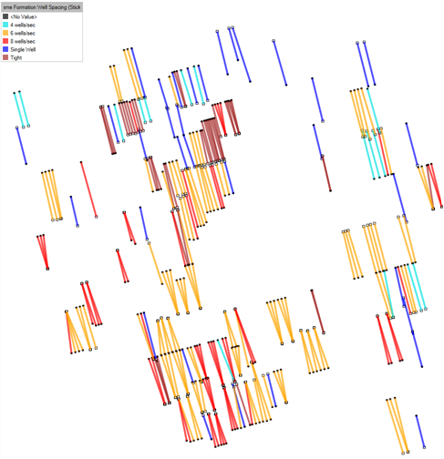
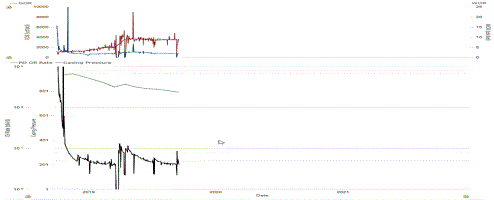

# 2025 v2 Release Notes

## New Features

### Type Well Scaling with Decisions

Simplify your undeveloped forecasting with Decisions-based type well
scaling: an important step in our journey to deliver the fastest and
most intelligent asset characterization in the market. The Decisions
concept, introduced in Val Nav 2025, acts as a central control for your
wells: distilling their characterization down to their critical drivers,
like development area, completion design, and lateral length. With their
extension to type wells, Decisions can now drive forecast, capital, and
operating costs together. Look out for Type Well Lookups coming in 2026!
Val Nav will automatically apply and scale undeveloped wells to keep
your asset model current with the latest type well and inventory
decisions.

### Per-Product Type Well Scaling

Gain finer control over undeveloped forecasts with per-product scaling
driven by Decisions, allowing you to capture the local operational and
reservoir variation that can impact wellhead production independently
without fragmenting your type well library. In heterogeneous
unconventional plays, there is constant tension between creating more
type wells to honor local variance and maintaining a manageable process
with statistically significant type wells. Per-product scaling resolves
this by letting you account for demonstrated performance differences
that don't justify their own type well. This flexibility strengthens
modeling fidelity, keeping your type well library lean while your
forecasts stay accurate.

### Extended Numeric and Date Binning

Identify the drivers behind the highest-performing wells in your asset
to optimize well design and sharpen your acquisition strategy with Val
Nav 2025 v2. With numeric and date binning integrated with our extensive
statistical analysis, uncover critical insights on performance from the
full spectrum of well data: from reservoir and geologic data to
completion and well design attributes. Bin any numeric or date attribute
to compare distributions, color well sticks and bubbles on the map, or
color scatter plots to answer questions like: How much proppant
intensity yields greater returns for type wells? Are completion trends
or outlier wells clustered spatially in the asset? Which operators or
completion styles are leading the pack? Are newer wells consistently
outperforming vintage ones? What is the true impact of parent/child
relationships?

### Visualizing Pressure During Graph-based Fits

Improve fit quality with our graph-based regression tools that now
overlay custom pressure fields alongside the product, allowing you to
make informed decisions about which trends to honor in your forecast.
This tighter coupling between surveillance data and decline analysis
strengthens the technical foundation of your base forecasting.

## Enhancements

- Extended support on Cross Plot tabs to Shared Plan Data.

## Bug Fixes

Fixed issues where: 

- Split By functionality did not work properly for Well Profile Type.
- The Custom Reporter reports fail when run on wells with UWIs longer
  than 50 characters.
- The data view did not show current start dates for anchored forecasts.
- The data view would not allow Duration Value Type to be shown without
  End Date Value Type.
- Certain data view templates would not load.
- The calculated duration would not show in the Declines data view.
- The Delete/Update Change Records dialog crashes when opened with a
  selection over 1,000 entities in an Oracle database.
- The forecast cache was not calculated properly after an XML import.
- Calculated results would show for inactive decline segments.
- The operational events data area would not reconcile properly.
- Custom fields could be created with some built-in fields causing
  issues with certain tools.
- The Realize Lookups command would fail if no jurisdictions existed in
  the project.
- Forecasts were removed on production imports due to inactive segments
  truncating them.
- The timeline tab crashes when pasting Project Start dates from Excel.
- Upgrades to Val Nav 2025 would fail when rescat capital was overridden
  but no input existed.

 
