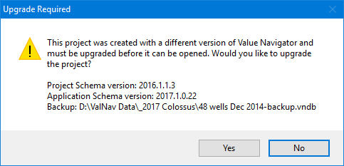

# Notes for IT

## Hardware and Software Requirements

See [Hardware and Software Requirements](../Getting%20Started%20with%20Value%20Navigator/Hardware%20and%20Software%20Requirements.md) .

## Installing Value Navigator

See [Install Value Navigator](../Getting%20Started%20with%20Value%20Navigator/Install%20Val%20Nav.md).

## Activating Value Navigator

See [Activate a
License](../Getting%20Started%20with%20Value%20Navigator/Licensing/Activate%20a%20License.md).

## Upgrading to Value Navigator 2026

See [Upgrade Value Navigator Projects](../Getting%20Started%20with%20Value%20Navigator/Upgrading%20to%20Value%20Navigator%202021.md).

## Creating a Backup of a Project File Database (\*.vndb)

A back-up copy of a project file database is created when you click Yes
in the Upgrade Required dialog box. The backup is stored in the same
folder and with the same name as the source database but with – backup
appended to the file name.

Information about the upgrade is stored in your Value Navigator log
file. You can access this file by clicking the hyperlink in the Project
Upgrade Progress dialog box.

## Creating a Backup of Oracle or SQL Server Databases (\*.vndl)

Value Navigator will not automatically create a backup database for
Oracle and SQL Server databases.

An Oracle/SQL Server database administrator (DBA) must create the
backup. Creating a backup database is strongly recommended before you
upgrade any Oracle or SQL Server database. If you have any questions,
contact [Value Navigator Support](../../Support.md).

## Upgrade Changes

If you upgrade to the 64-bit version of
Value
Navigator and are using a ..udl or a ..vnudl to connect to a data
provider (e.g. a PPDM hub, or a database with capital actuals), you will
need to change the name of the provider from MSDORA.1 to
Devart.Data.Oracle. Open the .udl/.vnudl file in a text editor, such as
Notepad, and replace the “Provider” in the file.

We also recommended this with Windows versions 8 and up.

## Schema Changes

See
[Value Navigator Schema Changes](../Schema%20Changes/Value%20Navigator%20Schema%20Changes.md).

## Pre-release Versions of Value Navigator

If you have pre-release versions of Value Navigator (such as a
Technology Preview or Beta versions), replace these with the release
version. You do not have to uninstall them. However, we do not support
the upgrade of projects in a pre-release version to the release version,
so please start fresh with a new database or re-upgrade your previous
database into the final release build.

## Microsoft Visual C++

Value Navigator
2026requires
Microsoft’s Visual C++ Redistributable, version 2013 or newer. This is
installed by running the .exe install file.

If you are repackaging, we provide .msi versions of the installer that
do not include the Visual C++ component, which you must install
separately.

## 64-bit Operating System

Value
Navigator can only be installed as 64-bit. The 32 bit version has
been discontinued as of version 2018.

## Licensing

Value
Navigator
2026 uses a
cloud-based licensing system. Previous versions use a separate,
file-based license system. The licenses you have for versions prior to
version 2016 will expire and not be renewed unless you request it. You
can run file-based or cloud-based
Value
Navigator versions simultaneously.

In order for your users to access the Value Navigator licensing server,
you must ensure:

- Firewall rules allow connection to licensing.energynavigator.com with
  access on port 443.
- Anti-virus software allows
  Value
  Navigator to access the internet
- Your system date and time is correct

See [Licensing Overview](../Getting%20Started%20with%20Value%20Navigator/Licensing/Licensing%20Overview.md).

For information on license roll-out with your internal packaging please
contact [Value Navigator Support](../../Support.md).

## License Administration Portal

You can administer and report on your own licenses in the License Admin
Portal.

To access the Portal, go to
[https://license-admin.energynavigator.com/](https://license-admin.energynavigator.com/Account/Login) or select
it from the Start menu of any computer with
Value
Navigator
2026 installed.

Contact [Value Navigator Support](../../Support.md) to request your Portal login name and password.

In the Portal, you can:

- Configure the number of concurrent offline users and the offline
  duration
- View the expiry date of your license
- View your Product Key
- View or cancel sessions
- View and export a record of instances where the maximum license count
  was reached
- Whitelist or blacklist users

See [View and Manage License
Usage](../Getting%20Started%20with%20Value%20Navigator/Licensing/View%20and%20Manage%20License%20Usage.md).

## Plug-ins

Many of our clients have been using plug-ins to augment specific
functionality in
Value
Navigator. We have included four of our most popular plug-ins
with the download for
2026.
Descriptions of these plug-ins are below. If you wish to use any of
these in your company, they must be loaded manually for each user who
wants to use them. Contact Support for assistance with this. See
[Install Plug-ins](../Plug-ins/Install%20Plug-ins.md).

Plug-ins, and their accompanying documentation, available in the folder
are:

- [Schedule Adjustment
  Plug-in](../Plug-ins/Schedule%20Adjustment%20Plug-in.md) – Changes
  the timing of the forecast start date, capital costs, and operating
  costs, while maintaining the time relationships between costs.
- [Delete Production Data
  Plug-in](../Plug-ins/Delete%20Production%20Data.md) – deletes
  historical production that may have been imported incorrectly.
- [Update or Delete Change Records](../Plug-ins/Update%20or%20Delete%20Change%20Records.md) – View all
  current change records in a database and delete them or edit their
  properties.
- [Behind-pipe Scheduling Tool](../Plug-ins/Behind-pipe%20Scheduling%20Plug-in.md) – Reschedule a set
  of wells, in sequence, such that each well’s start date is
  synchronized with the prior well’s economic limit.

Note that work flows previously handled by the *Working Interest Import
Plug-in* can all be accomplished in
Value
Navigator using the [Import Spreadsheet Data](../Importing%20and%20Exporting/Spreadsheet%20Import/Import%20Spreadsheet%20Data.md) and Data View tabs, so
this plug-in is no longer supported.

Please contact
[Value Navigator Support](../../Support.md) if you have a custom plug-in that has not been shipped with
your release.

## Known Issues

See [Known
Issues](../Getting%20Started%20with%20Value%20Navigator/Value%20Navigator%20Web%20Resources/Known%20Issues.md).
