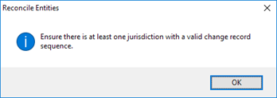
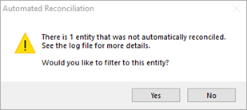
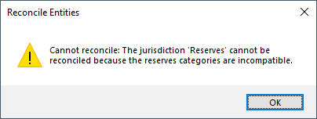

# Auto Reconcile Wells

You can auto-reconcile wells in the **Change Management** menu or on
**Review \| Waterfall** or **Review \| Change Records** by clicking
**Reconcile**.

The **Balance** button is for creating change records manually.

To auto-reconcile an entity or entities

1.  In the entity hierarchy, select the entity, entities (using CTRL +
    click or SHIFT + click), or folder you want to reconcile.
2.  Go to one of the locations below and click Reconcile:
    1.  **Change Management** menu
    2.  **Review \| Waterfall**
    3.  **Review \| Change Records**

1.  If required, select a **Jurisdiction** and click **OK**.

Change records are created and displayed on **Review \| Change
Records**. You can also view the results of the reconciliation on
**Review \| Waterfall**.

## Errors

If you receive the message below, your Change Record Sequence is not
valid. The most likely cause of this is having a Change Record Sequence
that doesn’t account for all Summary Types. To fix it, see
[Specify a Change Record Sequence](Specify%20a%20Change%20Record%20Sequence.md).

If you receive the message below, the entity is lacking a Change Reason.
See [Specify a Change Reason on Wells](Specify%20a%20Change%20Reason%20on%20Wells.md).

If you receive the message below, there are some reserves categories in
the selected jurisdiction that don’t exist between the Archive and the
Current Data.

