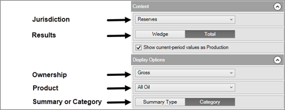

# Compare Reserves Balances on the Waterfall Chart

The Waterfall chart displays opening balances, changes, and current
reserves balances in a waterfall format. The chart is displayed on
**Review \| Waterfall**. The chart displays entity or folder level
results.

You can configure the display using the options in the top right, as
described below.

| Option | Description |
|----|----|
| Jurisdiction | Select the Jurisdiction. |
| Results | Select wedge results or total. In total mode, netted-out values are displayed (e.g., equal-and-offsetting category transfer records will net out and not be displayed). |
| Ownership | Gross, WI, Co. Share, Net. |
| Product | Select a product. |
| Summary Type or Change Record Category | Display results by summary type or change record category. |

