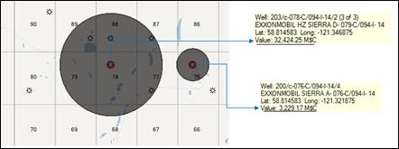
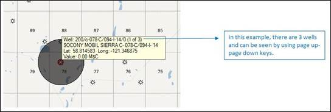

# Use Data Visualization

You can use data visualization to categorize and identify wells on the
map that meet certain criteria. For example, you can specify that all
wells with a 1+WOR forecast are displayed on the map with a green
bubble. The bubble size is relative to the data source. For example, the
entity with the largest Total Tax Paid is displayed with the largest
bubble.

Run economics on the wells before using bubble layers. Otherwise, the
bubbles will not be displayed on the map.

To adjust the data visualization settings

1.  On the **Map** tab, click .
2.  Click **Data Visualizations.**
3.  Under **Bubbles,** complete the following options:
    | Option | Description |
    |----|----|
    | Data Source | Select a data source for the bubbles. Wells will be displayed according to values in this source. For example, if you select GOR, only wells with GORS are displayed with bubbles. The larger the GOR value, the large the bubble will be. |
    | Scenario | Select a Scenario for the source of the bubbles. |
    | Color Source | Select a color source. Selecting source creates a colored legend for wells based on that criterion. For example, if you select Pool, all wells belonging to a Pool will be the same colour. |
    | Visible | Use the checkboxes to select the wells you want displayed on the map. |
    | Bubble Scale | Use the slider to adjust the bubble sizes. |
    | Transparency | Use the slider to adjust the bubble transparency. |
    | Size relative to map scale | Automatically scales the bubbles with the map scale. |

Changes are automatically displayed on the map.

## Scroll through Wells in a Location

Sometimes the location of wells is so close on the Map that the bubble
for one well obscures other wells. However, if you hold your cursor on
the well in the map area, the number of wells available at the location
is displayed. You can scroll through the locations using the **Page Up**
and **Page Down** keys on the keyboard.

