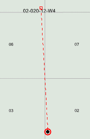

# View Horizontal Deviation on the Map

Horizontal wells are displayed on the map with a square to indicate the
surface location with a line leading to the bottomhole location, which
is displayed with the corresponding well symbol, as displayed below.

To display horizontal wells on the map, the wells must have **Surface
Latitude** and **Surface Longitude** values. To import the **Surface
Latitude** and **Longitude** values, do one of the following:

1.  [Update Production Using an External Data Source](../../Update%20Production/Update%20Wells%20Using%20an%20External%20Data%20Source.md)
2.  Import the values using the [Import Spreadsheet Data Overview](../../Importing%20and%20Exporting/Spreadsheet%20Import/Spreadsheet%20Import.md) tool
3.  Enter the values on **Wells and General Economics**

To display horizontal wells on the map

1.  On the **Map** tab, click .
2.  Under Entity **Layers**, select **Horizontal Deviation**.
